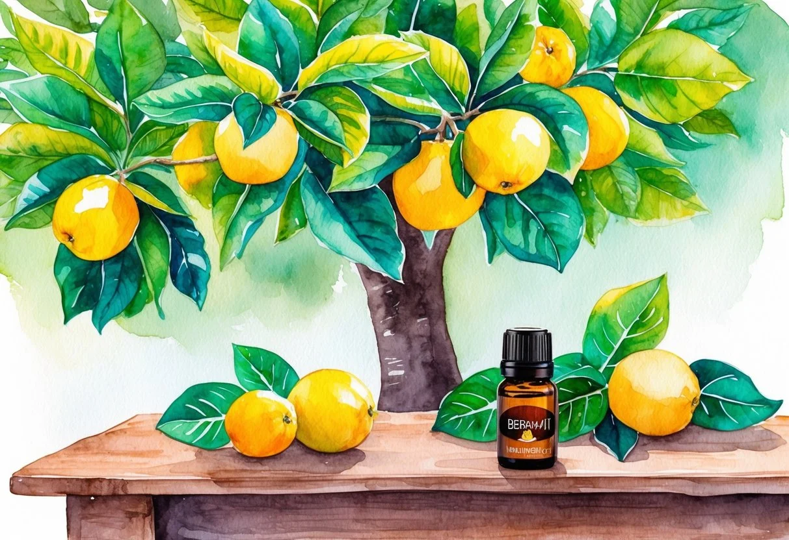

+++
title = "Les bienfaits et l'utilisation de l'huile essentielle de bergamote: Un guide complet pour la santé et le bien-être"
description = "Découvrez les bienfaits de l'huile essentielle de bergamote : apaisante, antibactérienne et parfaite pour l'aromathérapie, la cosmétique et le bien-être."
date = 2025-02-25
draft = false
[taxonomies]
tags = ["Bergamote", "Antiseptique", "Digestion", "Humeur", "Parfum", "Photosensibilisant", "CosmétiqueNaturelle", "Méditation", "Concentration", "SoinDuCorps", "Parfumerie"]
+++

L'[huile essentielle de bergamote](https://jardinessentiel.fr/fr/tags/huileessentielle/) est appréciée pour ses multiples vertus, que ce soit pour l'[aromathérapie](https://jardinessentiel.fr/fr/tags/aromatherapie/), la cosmétique ou la santé.

**Elle est connue pour ses propriétés apaisantes et peut aider à améliorer l'humeur et réduire le stress.**

Cette huile est extraite des fruits de la bergamote, un agrume qui pousse principalement en Calabre, en Italie.

Depuis des siècles, la bergamote est utilisée dans divers domaines grâce à ses propriétés bénéfiques.

En cosmétique, elle est prisée pour son parfum frais et vibrant, souvent utilisée dans la fabrication de parfums et de produits de soin.

L'aromathérapie l'utilise également pour ses effets calmants, apportant détente et bien-être.

Elle contient des composés actifs qui en font un excellent remède naturel pour divers troubles.

En plus de ses bienfaits sur l'humeur, l'[huile de bergamote](https://doterra.me/IsUxHq) peut aussi être appliquée pour des problèmes de peau ou comme tonifiant.

Elle doit cependant être utilisée avec précaution, notamment en cas d'exposition au soleil.

### Principaux Points à Retenir

* L'huile essentielle de bergamote apaise et améliore l'humeur.
* Utilisée en cosmétique pour ses propriétés aromatiques.
* Nécessite une utilisation prudente en raison de ses effets photosensibilisants.

## Histoire et Origine de la Bergamote

La bergamote, connue pour son parfum envoûtant et ses nombreux [bienfaits](https://jardinessentiel.fr/fr/tags/soinsnaturels/), provient principalement de l'arbre *Citrus bergamia*.

Sa culture est centrée dans des régions ensoleillées, particulièrement en Italie, où les conditions climatiques sont idéales. Historiquement, elle a traversé de nombreux continents avant de s'installer en Europe.

### Citrus bergamia et Citrus aurantium var

*Citrus bergamia*, souvent simplement appelé bergamote, est un arbre fruitier apprécié pour ses fruits à peau épaisse et parfumée.

Ce fruit est une variété de l'oranger, apparenté au *Citrus aurantium var*. Cette dernière est une variété d'orange amère qui partage certaines caractéristiques avec la bergamote.

Historiquement, les origines exactes du *Citrus bergamia* sont entourées de mystère.

Certaines théories suggèrent qu'il a été introduit en Europe par les croisés. D'autres hypothèses soutiennent qu'il s'agit d'une hybridation spécifique, bien que cela reste incertain.

Les différences entre ces variétés résident souvent dans les usages et les arômes distincts qu'elles procurent.

### Cultivation et Récolte

La culture de la bergamote est principalement concentrée dans la région de Calabre, en Italie.

C'est ici que les conditions de température et de sol sont idéales pour la culture du *Citrus bergamia*. Cet arbre préfère un climat doux et un sol bien drainé.

Les récoltes se déroulent généralement de novembre à janvier, période où les fruits atteignent leur maturité.

La méthode de récolte traditionnelle favorise une cueillette à la main pour éviter d'endommager les fruits sensibles.

La production est essentiellement destinée à l'extraction d'huile essentielle, très appréciée en parfumerie et en [médecine naturelle](https://jardinessentiel.fr/fr/tags/santenaturelle/).

## Propriétés et Composants

L'[huile essentielle de bergamote](https://doterra.me/IsUxHq) est connue pour ses propriétés antibactériennes et son contenu en composés chimiques spécifiques, tels que le linalol et d'autres esters. Ces caractéristiques font d'elle une huile essentielle polyvalente utilisable dans de nombreux domaines.

### Propriétés Antibactériennes

L'huile essentielle de bergamote possède des **propriétés antibactériennes** puissantes.

Elle est efficace contre plusieurs types de bactéries, y compris l'Escherichia coli et le Staphylococcus aureus.

Ces propriétés aident à réduire les infections et sont souvent utilisées dans des applications dermatologiques et cosmétiques pour purifier la peau.

Son efficacité antibactérienne est principalement due à la présence de composés chimiques qui pénètrent les membranes cellulaires des bactéries, entravant leur croissance.

Cette fonction en fait un ingrédient recherché dans les produits conçus pour traiter les affections cutanées, tout en offrant une alternative naturelle aux agents antibactériens synthétiques.

Cet aspect est essentiel pour les personnes cherchant des solutions plus naturelles dans leur routine de soin.

### Linalol et Autres Composants Chimiques

Le linalol est un composant clé de l'huile essentielle de bergamote. Ce composé contribue à ses effets relaxants et apaisants.

Outre le linalol, l'huile contient d'autres *esters* qui intensifient ses propriétés thérapeutiques, comme son caractère calmant et antiseptique.

Ces composés influencent également l'arôme distinct et agréable de l'huile, ce qui augmente son usage en parfumerie et en aromathérapie.

Le linalol, en particulier, est reconnu pour son rôle dans la réduction du stress et l'amélioration de l'humeur, soulignant son importance non seulement pour la santé physique mais aussi mentale.

Ces propriétés font de l'huile un choix populaire pour ceux qui cherchent à intégrer des produits naturels dans leurs soins quotidiens.

## Bienfaits pour la Santé

L'huile essentielle de bergamote est prisée pour ses effets apaisants sur l'anxiété et la dépression.

Elle est aussi reconnue pour améliorer la concentration et favoriser la relaxation. En plus de cela, elle aide à soulager les troubles digestifs.

### Effets sur l'Anxiété et la Dépression

L'huile essentielle de bergamote est connue pour ses propriétés apaisantes.

Elle peut aider à réduire les symptômes d'anxiété et de dépression.

En inhalation, elle stimule la libération de neurotransmetteurs tels que la sérotonine et la dopamine.

Ces neurotransmetteurs jouent un rôle clé dans l'atténuation des sentiments de stress et de tristesse.

Les chercheurs ont montré que la bergamote peut avoir des effets calmants après quelques minutes d'inhalation.

Cette capacité à influencer positivement l'humeur fait de l'huile essentielle de bergamote un allié naturel pour ceux qui souffrent de détresse émotionnelle.

### Aide à la Concentration et à la Relaxation

En tant qu'agent relaxant, l'huile essentielle de bergamote aide à apaiser le corps et l'esprit.

Elle favorise ainsi la concentration.

Lorsqu'elle est diffusée dans l'air, elle crée un environnement calme et propice au travail intellectuel.

Cela est possible grâce aux composants actifs de la bergamote qui interagissent avec le système nerveux central.

Pour ceux qui ont des difficultés à se concentrer ou à se détendre après une journée intense, l'huile essentielle de bergamote peut être une solution simple et efficace.

### Digestion et Troubles Digestifs

Cette huile essentielle est également bénéfique pour la santé digestive.

Elle peut soulager les troubles digestifs tels que les ballonnements et les spasmes intestinaux.

En usage externe, elle est appliquée sur l'abdomen pour stimuler la digestion, grâce à son effet anti-inflammatoire.

Les propriétés antibactériennes de la bergamote aident à maintenir un équilibre sain de la flore intestinale.

Pour les personnes souffrant de problèmes digestifs fréquents, l'huile essentielle de bergamote constitue une alternative naturelle pour apaiser ces désagréments.

## Applications en Aromathérapie

L'huile essentielle de bergamote est renommée pour son large éventail d'utilisations en aromathérapie.

Elle offre des avantages spécifiques dans deux formes principales d'application : la diffusion et l'inhalation, ainsi que le massage et l'application topique.

### Diffusion et Inhalation

L'inhalation est l'une des méthodes les plus populaires pour utiliser l'huile essentielle de bergamote.

En diffusion, quelques gouttes sont ajoutées à un diffuseur pour libérer son parfum apaisant dans l'air. Cette méthode peut aider à réduire le stress et favoriser une [ambiance relaxante](https://jardinessentiel.fr/fr/benefits-and-usage-of-lavender-essential-oil/) dans la maison.

La pratique de l'olfaction est également efficace pour l'humeur. Respirer directement cette huile essentielle peut améliorer l'état émotionnel en peu de temps.

Certains adeptes recommandent son utilisation lors de la méditation pour renforcer le bien-être mental.

L'huile essentielle de bergamote est aussi connue pour son rôle dans le thé, notamment le [thé noir Earl Grey](https://www.passeportsante.net/fr/Solutions/HuilesEssentielles/Fiche.aspx?doc=huile-essentielle-bergamote), grâce à son arôme caractéristique.

Ce mélange stimule les sens tout en offrant un goût unique et raffiné.

### Massage et Application Topique

Lorsqu'elle est utilisée en massage, l'huile de bergamote peut être diluée avec une huile de support. Ce mélange permet de tirer parti de ses propriétés antispasmodiques et antiseptiques.

Appliquée directement sur la peau, elle favorise la relaxation musculaire et l'hydratation cutanée.

Ce type d'application aide aussi à améliorer la circulation sanguine. Les mouvements de massage, combinés avec l'effet de l'huile essentielle, peuvent apporter une sensation de fraîcheur et de soulagement.

Pour ceux qui ont une peau sensible, il est important de faire un test de patch pour éviter les irritations.

Cette huile, avec ses nombreux bienfaits, est une addition précieuse aux routines de massage thérapeutiques.

## Utilisation en Cosmétique et Parfumerie

L'huile essentielle de bergamote est prisée pour son arôme puissant et ses propriétés uniques en cosmétique et parfumerie. Elle est souvent utilisée pour ses notes fraîches et citronnées qui ajoutent une touche raffinée aux produits.

### Huiles et Parfums

Dans la fabrication de parfums, l'huile essentielle de bergamote joue souvent le rôle de note de tête. Elle se distingue par son arôme puissant et sa capacité à se marier avec d'autres essences.

Les parfums renommés, notamment ceux incluant l’eau de Cologne, incluent cette huile pour donner une touche de fraîcheur et de vivacité. Ce caractère unique est obtenu grâce à son extraction par compression à froid.

En cosmétique, son parfum délicat et tonique améliore des produits comme les lotions et les crèmes.

Utilisée dans les huiles corporelles, elle offre une senteur agréable tout en favorisant une ambiance apaisante.

### Considérations sur l'Utilisation Cutanée

L'application cutanée de l'huile essentielle de bergamote doit se faire prudemment. Elle peut être photosensibilisante.

Par conséquent, son emploi juste avant une exposition au soleil est déconseillé.

Pour ceux avec une [peau sensible](https://jardinessentiel.fr/fr/tags/peau/) ou des conditions comme le psoriasis ou l'eczéma, effectuer un test cutané avant une utilisation régulière est recommandé.

Ses propriétés apaisantes aident à calmer les [inflammations](https://jardinessentiel.fr/fr/tags/phytotherapie/), mais l'application doit être diluée dans une huile de base pour éviter les irritations.

Évitez d’appliquer sur les peaux endommagées et observez toute réaction allergique pour garantir une utilisation sécuritaire et efficace.

## Précautions et Effets Secondaires

L'huile essentielle de bergamote a plusieurs utilisations bénéfiques, mais elle doit être manipulée avec soin. Une mauvaise utilisation peut entraîner des problèmes comme des réactions cutanées ou des interactions indésirables avec d'autres substances.

### Conseils d'Utilisation et Contre-indications

L'huile essentielle de bergamote est connue pour ses [propriétés antiseptiques](https://jardinessentiel.fr/fr/benefits-and-usage-of-tea-tree-essential-oil/) et ses effets positifs sur la déprime. Pourtant, elle nécessite des précautions d'usage.

Il est essentiel d'éviter l'application directe sur la peau sans une huile porteuse, car cela peut causer des irritations ou des brûlures.

L'exposition au soleil après application cutanée peut aussi conduire à une photosensibilité.

Les interactions peuvent survenir, surtout si elle est prise par voie orale.

Les personnes souffrant d'[infections](https://jardinessentiel.fr/fr/tags/antifongique/) ou ayant une sensibilité particulière à certaines substances doivent consulter un professionnel de santé avant usage.

Il faut également faire preuve de vigilance en cas d'utilisation sur les enfants, les femmes enceintes ou allaitantes, car certaines contre-indications existent.

Pour en savoir plus, visitez [les contre-indications de l'huile essentielle de bergamote](https://aromatherapiepassion.com/contre-indications-huile-essentielle-bergamote-quil-faut-savoir).

### Interactions et Précautions

Concernant les interactions, l'huile essentielle de bergamote peut influencer le niveau de cortisol, une hormone impliquée dans la réponse au stress. Cela peut accentuer des effets psychologiques comme l'anxiété ou la déprime.

Par conséquent, l'utilisation simultanée avec d'autres substances affectant le cortisol nécessite une attention particulière.

L'essence de bergamote est aussi reconnue pour combattre certaines bactéries et infections.

Cependant, l'association avec des traitements médicamenteux peut entraîner des effets secondaires imprévus. Consulter un professionnel de santé permet de minimiser ces potentiels dangers.

Le respect des indications spécifiques que vous pouvez trouver [ici](https://fr.puressentiel.com/blogs/conseils/huile-essentielle-precaution-emploi) est crucial pour une utilisation sécuritaire.

## Méthodes et Conseils d'Utilisation

L'[huile essentielle de bergamote](https://doterra.me/IsUxHq) peut être utilisée de différentes manières pour améliorer le bien-être. La diffusion et le massage sont populaires, et des recettes simples comme l'ajout au thé offrent des avantages aromatiques et apaisants.

### Comment Utiliser l’Huile Essentielle de Bergamote

**Diffusion**: L'une des méthodes les plus courantes est la diffusion. Pour cela, quelques gouttes dans un diffuseur peuvent suffire. Elle est souvent utilisée dans les espaces de détente pour promouvoir une ambiance relaxante.

**Massage**: En massage, elle est généralement mélangée avec une huile de support comme l'huile de jojoba. Appliquer le mélange sur les tempes ou le cou pour réduire le stress. Assurez-vous que la peau n'est pas exposée au soleil immédiatement après pour éviter les réactions photosensibles.

**Inhalation**: L'inhalation directe peut aussi être bénéfique. Mettre quelques gouttes sur un mouchoir et inspirer profondément est simple et rapide. Cette méthode est dite efficace pour calmer l'esprit rapidement.

### Recettes et Mélanges

**Huile de Massage Relaxante**: Pour une huile de massage, mélanger cinq gouttes d'huile essentielle de bergamote avec deux cuillères à soupe d'huile de support. Ce mélange peut être appliqué sur les muscles fatigués.

**Thé Aromatisé**: Ajouter une goutte d'huile essentielle de bergamote à une tasse de thé noir peut enrichir la boisson de propriétés apaisantes. Assurez-vous que l'huile est de qualité alimentaire avant de l'ajouter à des boissons.

**Diffuseur Maison**: Un mélange pour diffuseur peut inclure trois gouttes d'huile de bergamote, deux gouttes de lavande et une goutte de bois de santal. Ce mixage vise à encourager la tranquillité à la maison.

## Recherche Scientifique et Médicale

L'huile essentielle de bergamote est souvent étudiée dans le cadre de la médecine complémentaire pour ses **effets psychologiques** et **physiologiques**.

Elle est réputée pour réduire les niveaux de **cortisol**, l'hormone du stress, apportant ainsi un sentiment de bien-être.

Des recherches montrent que l'huile essentielle de bergamote a des **propriétés antibactériennes**.

Elle est efficace contre des bactéries comme *Campylobacter jejuni*, *Listeria monocytogenes*, et *Bacillus cereus*. Cela la rend utile dans des formulations antiseptiques et pour améliorer l'hygiène.

La bergamote contient le composé **linalool**, qui est étudié pour ses effets relaxants. Le linalool a été associé à des améliorations dans l'humeur et la réduction de l'anxiété.

### Liste des Principaux Avantages :

* **Psychologiques** : réduction de l'anxiété, amélioration de l'humeur
* **Antiseptique** : lutte contre les bactéries et champignons comme *Candida*
* **Antibactérienne** : efficace contre divers micro-organismes

Les **propriétés antibactériennes** et l'action **antiseptique** de l'huile démontrent son potentiel dans les traitements médicaux.

Contrairement à d'autres huiles essentielles, l'[huile de bergamote](https://doterra.me/IsUxHq) est particulièrement efficace pour combattre des infections respiratoires et digestives.

Les études indiquent que ses composants actives comme les esters contribuent à son efficacité.
