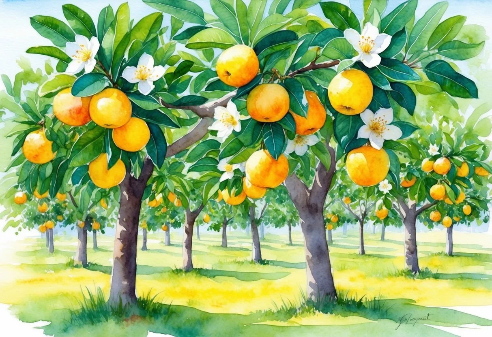
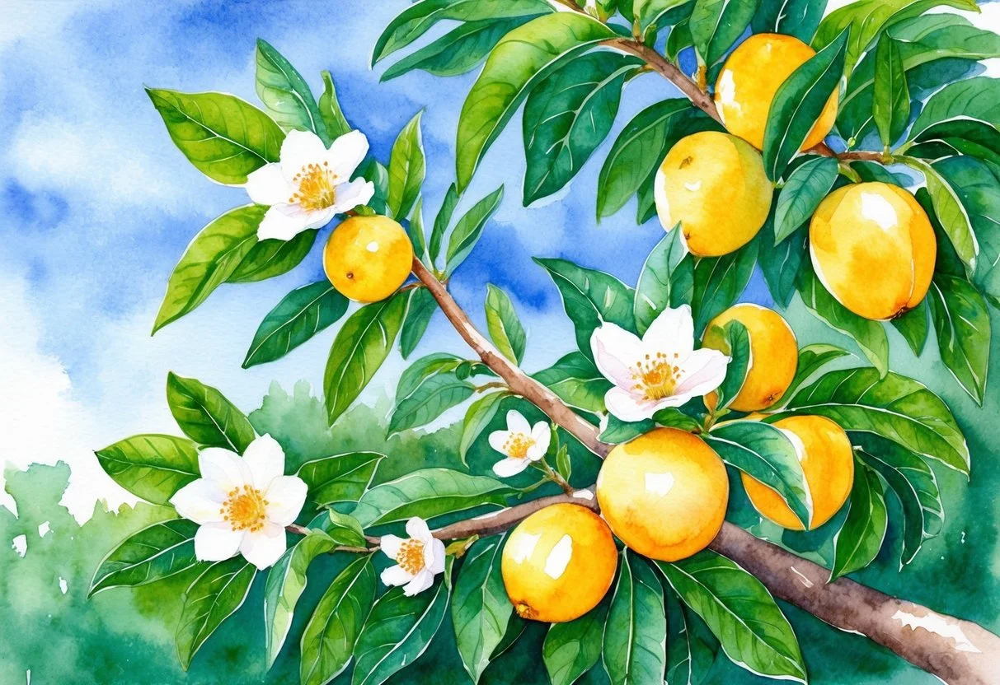
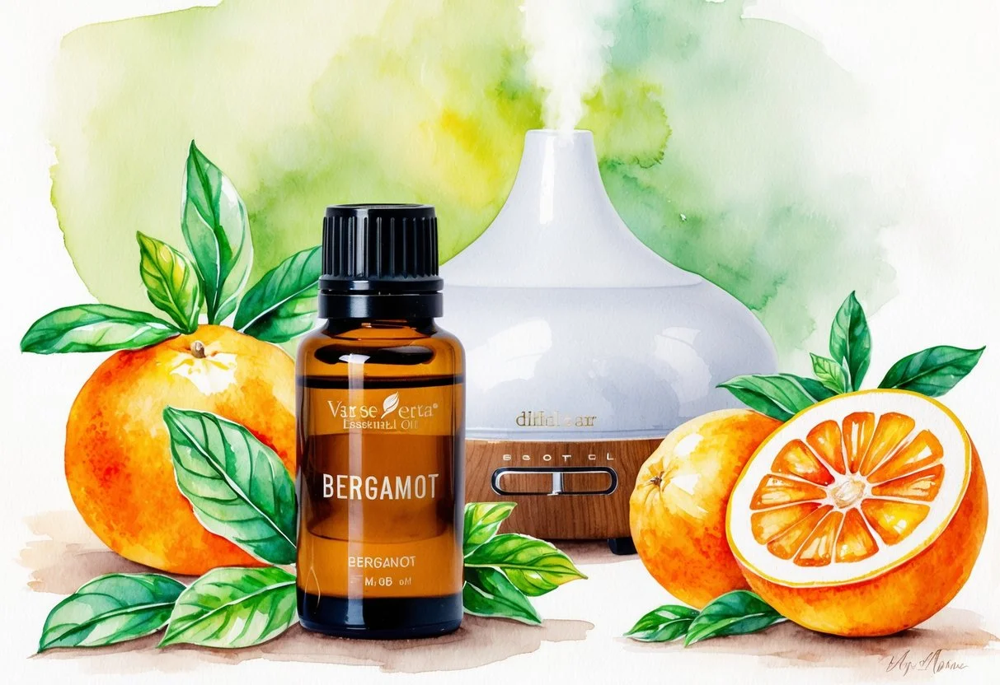

+++
title = "A bergamott illóolaj kedvező hatásai és használata: Egészség és wellness a természet erejével"
description = "A bergamott illóolaj csökkenti a stresszt, javítja a hangulatot és támogatja a bőrápolást. Ismerd meg jótékony hatásait és használati módjait!"
date = 2025-02-25
draft = false
[taxonomies]
tags = ["hangulatjavító", "szorongáscsökkentő", "fototoxikus hatás", "citrusos illóolaj", "érzelmi egyensúly", "természetes relaxáció", "stresszkezelés", "nyugtató hatás", "bergamott illóolaj", "bőrfertőtlenítés"]
+++

A [bergamott illóolaj](https://doterra.me/IBr_Hh), melyet a bergamot gyümölcs héjából nyernek, különleges aromájával és jótékony hatásaival egyre szélesebb körben elismert.

**A bergamott illóolaj egyik legértékesebb tulajdonsága, hogy képes enyhíteni a szorongás tüneteit és javítani a hangulatot.**

Ezt a citrusos illatú olajat sokan használják lelki nyugtatóként, mely egyensúlyt teremt és megkönnyíti a mindennapi stresszel való megbirkózást.

Az illóolaj alkalmazása sokrétű, ami növeli népszerűségét.

Nemcsak a pszichére gyakorolt pozitív hatásai miatt kedvelt, hanem a fizikai közérzet támogatására is, például a [hajnövekedés](https://jardinessentiel.fr/hu/tags/fejbor-egeszsege/) serkentésére.

Az [aromaterápiában](https://jardinessentiel.fr/hu/tags/aromaterapia/) is gyakran használt, és fontos szerepe van az életminőség javításában.

### A legfontosabb tanulságok

* A bergamott illóolaj javítja a hangulatot és enyhíti a szorongást.
* Több módon is alkalmazható, például aromaterápiában.
* Széles körben elismert a citrusos illatáért és jótékony tulajdonságaiért.

## A bergamott illóolaj előnyei

A bergamott illóolaj számos előnnyel rendelkezik, amelyek javíthatják az érzelmi jólétet és támogathatják a fizikai egészséget. Különösen hasznos lehet a stressz és a bőrproblémák kezelésében.

### Nyugtató és hangulatjavító hatások

A bergamott illóolaj ismert **nyugtató** tulajdonságairól, amelyek segíthetnek csökkenteni a stresszt és a szorongást.

Az illóolaj képes növelni a szerotonin és a dopamin szintjét, amelyek az agyban a boldogság érzetéért felelősek.

Emiatt különösen hasznos lehet azok számára, akik **depresszió** vagy **álmatlanság** tüneteit tapasztalják.

Az illóolaj alkalmazása elősegíti a relaxációt, enyhítheti a feszültséget, és hozzájárulhat az **érzelmi egyensúly** helyreállításához.

Ezért sokan használják aromaterápiában, hogy békésebb és kiegyensúlyozottabb lelki állapotot érjenek el.

Természetes módon nyugtatja az elmét, ami kifejezetten hasznos lehet a hétköznapi stresszes helyzetek kezelésére.

### Antibakteriális és gyulladáscsökkentő tulajdonságok

A **bergamott olaja** kiváló **antibakteriális** és **[gyulladáscsökkentő](https://jardinessentiel.fr/hu/tags/gyulladascsokkento/)** hatású.

Ez a két tulajdonság segíthet a bőrproblémák, például a **[pattanások](https://jardinessentiel.fr/hu/tags/pattanasok-kezelese/) és akné** kezelésében.

Az olaj **fertőtlenítő** hatása miatt hatékony lehet a bőrfertőzések ellen, és elősegíti a bőr egészségének fenntartását.

Ezenkívül a bergamott illóolaj használata támogathatja az egész szervezet egészségét, segíthet a **húgyúti fertőzések** kezelésében is.

Az illóolaj antiszeptikus jellege hozzájárulhat a káros baktériumok elleni küzdelemhez, és segíthet fenntartani a bőr és a test egészséges állapotát.

## A bergamott illóolaj alkalmazási módjai

A [bergamott illóolaj](https://doterra.me/IBr_Hh)nál fontos az alkalmazási mód megválasztásakor a bőrtípus figyelembevétele és az, hogy milyen hatást szeretnénk elérni.

Különböző módokon használható, például aromaterápiához diffúzorban vagy külsőleg [bőrápolás](https://jardinessentiel.fr/hu/tags/levendulaolaj-hasznalata/)ra.

### Aromaterápia és diffúzor használata

Az aromaterápia népszerű módja annak, hogy a bergamott illóolaj relaxáló vagy energizáló hatását élvezhessék az illóolaj-használók.

A **diffúzor** segítségével a citrusos illat könnyedén elterjed egy szobában, hozzájárulva a nyugalomhoz és kiegyensúlyozott légkörhöz. Ehhez cseppentsenek néhány cseppet a diffúzor víztartályába.

Az aromás tulajdonságok nemcsak az otthoni környezet javítására szolgálnak, hanem ízléstől függően támaszt nyújtanak a parfümipar területén is.

Azok, akik érzékenyek vagy allergiás reakcióktól tartanak, kezdetben óvatosan próbálják ki, hogy elkerüljék az esetleges kellemetlenségeket.

### Külsőleges alkalmazás

Külsőleg alkalmazva a bergamott illóolajat gyakran keverik egy **hordozóolajjal**, például jojoba- vagy kókuszolajjal, hogy testápolókhoz adják.

Ez különösen előnyös zsíros bőr vagy ekcéma esetén.

Azonban fontos, hogy ne feledjék, a bergamott illóolaj **fototoxikus** hatású lehet, ami azt jelenti, hogy használat után bőrfényérzékenységet okozhat napfény hatására.

A bőrápolás során gondoskodni kell róla, hogy kis bőrfelületen próbálják ki először, és várják meg, hogy nem jelentkezik-e bőrirritáció vagy allergiás reakció.

Ez biztonságot nyújt, miközben élvezhetik a bergamott megnyugtató hatásait.

## Egyéb jellemzők és megfontolandó tényezők

A bergamott illóolaj különleges jellemzőkkel bír, amelyek figyelemre méltók. Ezek kiterjednek a gyümölcs jellegzetességeire és az egészségügyi, biztonsági tényezőkre, amelyeket használat előtt érdemes megfontolni.

### Bergamott citrus gyümölcs jellegzetességei

A bergamott a citrusfélék közé tartozik, pontosabban a *Citrus bergamia*, amely elsősorban Dél-Olaszországban terem.

Gyümölcse sárga és kicsit keserű, és gyakran használják fűszerként és illóolajok alapanyagaként.

A gyümölcs héja különösen gazdag illóolajokban. Az olaj hideg sajtolással kerül kinyerésre, ami megőrzi frissítő és citrusos illatát.

Ez a folyamat biztosítja, hogy a bergamott olaj megőrizze jellegzetes tulajdonságait, mint például a [fűszeres és friss](https://jardinessentiel.fr/hu/tags/teafaolaj-hatasai/) illatjegyek.

### Egészségügyi és biztonsági tudnivalók

A bergamott illóolajnak [gyógyászati előnyei](https://jardinessentiel.fr/hu/tags/termeszetes-gyogymod/) lehetnek, mint az étvágyfokozás vagy segítség az ADHD kezelésében.

Ugyanakkor fontos a biztonságos használat, mivel a bergamott olaj fototoxikus lehet.

A bőrre gyakorolt hatása miatt alkalmazása után kerülni kell a közvetlen napfényt, hogy elkerüljük a fényérzékeny reakciókat.

Bőrpróba javasolt az allergiás reakciók elkerülése végett.

A [bergamott illóolaj](https://doterra.me/IBr_Hh) samponokban is megtalálható, ahol frissítő és fűszeres tulajdonságait kamatoztatják.

Ezek a tényezők kulcsfontosságúak a megfelelő és biztonságos használat érdekében.
