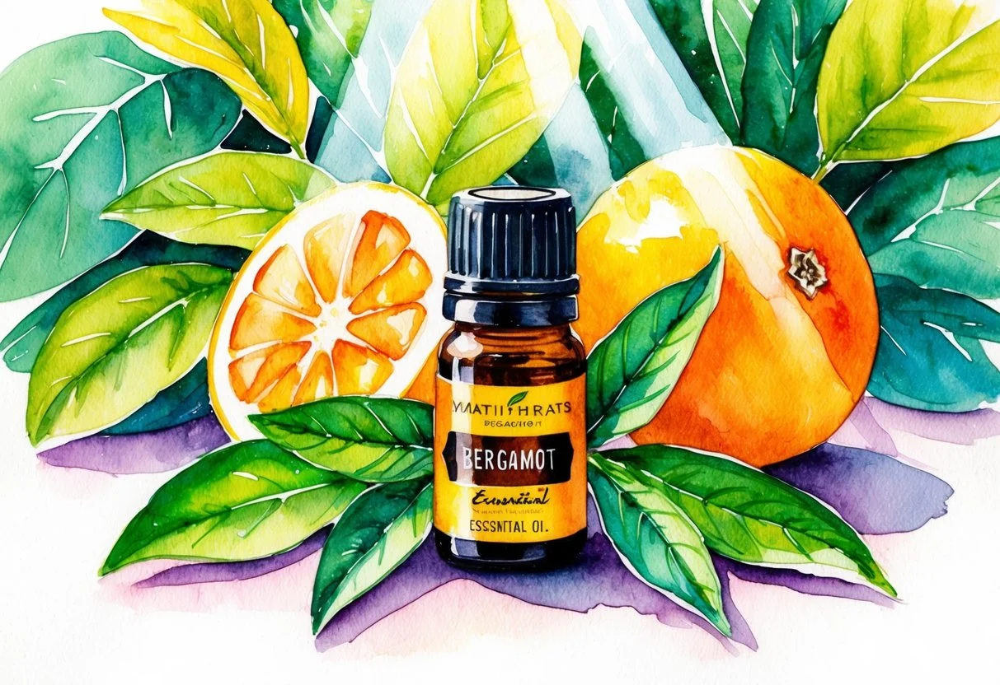
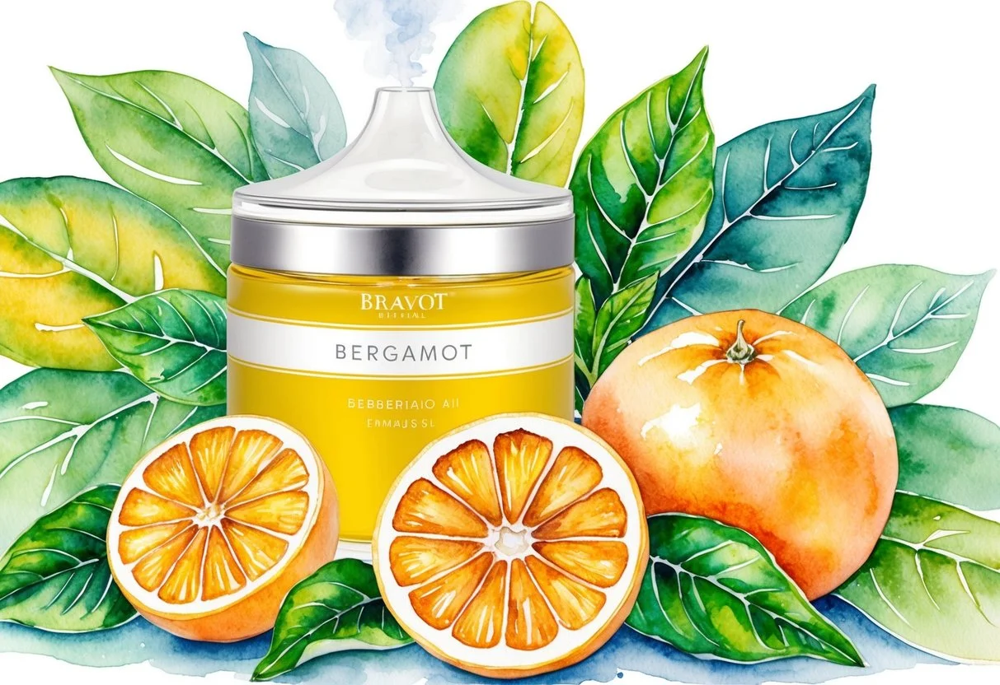
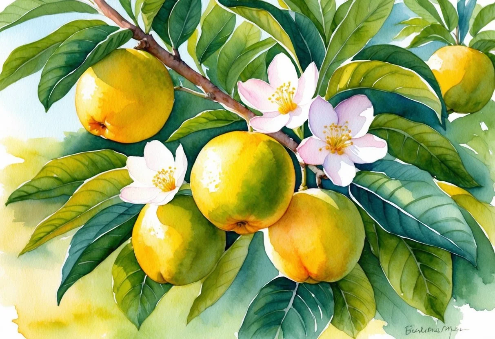

+++
title = "Benefits and Usage of Bergamot Essential Oil: A Comprehensive Guide"
description = "Bergamot essential oil boosts relaxation, uplifts mood, and enhances skin health. Learn its benefits, uses, and safety tips for a natural wellness routine."
date = 2025-02-25
draft = false
[taxonomies]
tags = ["Aromatherapy with bergamot", "Benefits of bergamot oil", "Bergamot essential oil", "Essential oils for relaxation", "Essential oils for stress relief", "Holistic healing", "Natural remedies", "Organic skincare", "Essential oils for skin", "Uses of bergamot essential oil"]
+++

[Bergamot essential oil](https://doterra.me/jtJ4pJ), derived from the peel of the Citrus bergamia fruit, offers a refreshing and citrusy aroma.

It's a favorite in aromatherapy for its soothing and uplifting properties.

When used with a carrier oil, it can [enhance skin health](https://jardinessentiel.fr/tags/essential-oils-for-skin/) and reduce stress.

**Bergamot oil is praised for its ability to [promote relaxation](https://jardinessentiel.fr/benefits-and-usage-of-lavender-essential-oil/) and [improve mood](https://jardinessentiel.fr/tags/benefits-of-lavender-oil/)**, making it a popular choice for use in diffusers and personal care products.

The unique composition of bergamot oil gives it a wide range of benefits.

It contains compounds known for their ability to reduce inflammation and support emotional well-being.

Incorporating this oil into daily routines can boost mental clarity and relaxation, providing a natural way to unwind after a stressful day.

It can also be combined with other oils to enhance its effects, creating a customized aromatherapy experience.

Safety is crucial when using essential oils, and bergamot oil is no exception.

It should be properly diluted before topical application, as undiluted use can irritate the skin.

Also, exposure to sunlight after using bergamot oil on the skin should be avoided due to its photosensitivity.

By using it correctly, individuals can enjoy its full range of benefits while maintaining safe practices.

### Key Takeaways

* Bergamot oil enhances mood and relaxation.
* Use it safely by diluting and avoiding sunlight exposure on the skin.
* Combines well with other oils for a richer aromatherapy experience.

## Bergamot Essential Oil Profile

Bergamot essential oil is derived from the bergamot orange, primarily grown in Calabria, Italy.

It is cherished for its refreshing citrus scent and numerous health benefits. Understanding its botanical origins, chemical components, and extraction process is crucial for fully appreciating its value.

### Botanical Background

The bergamot tree, scientifically known as *Citrus bergamia*, produces the bergamot fruit from which this essential oil is extracted.

This evergreen tree thrives in Mediterranean climates, particularly in the Calabria region of Italy, where optimal conditions enhance the fruit's quality.

The fruit resembles a small orange but is more pear-shaped.

Bergamot belongs to the citrus family, sharing the same lineage as lemons, limes, and bitter oranges.

This botanical connection explains its aromatic and citrus notes that are similar to those found in other citrus oils.

### Chemical Composition

Bergamot essential oil boasts a complex chemical profile.

It contains several key compounds such as linalool and limonene, which contribute to its distinctive fragrance and benefits.

Linalool is known for its [calming properties](https://jardinessentiel.fr/tags/lavender-essential-oil/), while limonene offers mood-enhancing effects.

Another important component is bergapten, which makes cold-pressed forms of the oil phototoxic, meaning it can cause skin reactions when exposed to sunlight.

Other constituents found in bergamot oil include nerol and geraniol, which further enhance its [aromatic profile](https://jardinessentiel.fr/benefits-and-usage-of-lavender-essential-oil/) and effectiveness in [skin care](https://jardinessentiel.fr/tags/tea-tree-essential-oil/).

### Method of Extraction

The primary method used for extracting bergamot oil is cold pressing, a technique that involves mechanically pressing the bergamot fruit's peel to release the oil.

This results in a potent and aromatic oil, rich in beneficial compounds.

While cold pressing is common, steam distillation offers an alternative method that reduces the risk of phototoxicity by eliminating bergapten.

This method involves using steam to gently extract the oil, making the resulting product safer for topical use without sunlight exposure.

Both methods capture the essence of bergamot, each suited to different applications and user preferences.

## Therapeutic Properties

[Bergamot essential oil](https://doterra.me/jtJ4pJ) offers a range of therapeutic properties, making it beneficial for [mental well-being](https://jardinessentiel.fr/tags/uses-of-lavender-essential-oil/), [pain relief](https://jardinessentiel.fr/benefits-and-usage-of-tea-tree-essential-oil/), and enhancing skin health.

### Aromatherapy and Mental Health

Bergamot oil is renowned for its ability to support mental health through aromatherapy.

Its citrus aroma has **antidepressant** effects that can uplift mood and support emotional well-being.

By acting as a **relaxant** and **sedative**, it helps reduce **anxiety** and stress levels.

When inhaled, it aids in the release of neurotransmitters like serotonin and dopamine, which are key in creating a sense of happiness and calm.

In diffusion therapy, the scent promotes **stress relief** by creating a soothing environment.

Many people use bergamot oil in **aromatherapy** to alleviate feelings of sadness and restlessness.

This makes it a popular choice in holistic practices aimed at enhancing mental clarity and emotional balance.

### Analgesic Effects

Bergamot oil exhibits potent **analgesic properties**, aiding in the reduction of pain.

Its use in pain relief is attributed to its **antispasmodic** qualities, which help relax muscles and reduce discomfort.

When combined with a carrier oil, a massage using bergamot oil can alleviate muscle tension and soothe soreness.

Its anti-inflammatory and **[antibacterial properties](https://jardinessentiel.fr/tags/benefits-of-tea-tree-oil/)** further contribute to its effectiveness in managing pain and reducing inflammation.

This makes it valuable for individuals seeking natural options for **pain relief** from conditions like headaches, migraines, and joint pain.

### Skin Care Applications

In skin care, bergamot oil is respected for its ability to enhance **skin health**.

Its **antifungal** and antibacterial properties make it effective in treating skin conditions such as **eczema** and **psoriasis**.

The oil’s **anti-inflammatory properties** help reduce **skin irritation**, promoting a clearer complexion.

When mixed with carrier oils, bergamot oil can be applied topically to improve skin texture and appearance.

It is often included in **skincare** routines for its ability to balance oil production and fight off acne-causing bacteria.

## Applications and Uses

Bergamot essential oil is versatile and utilized in various ways to promote well-being, improve mood, and enhance skincare.

### Inhalation and Diffusion

Inhaling bergamot essential oil is a popular method to experience its calming and uplifting properties.

By using a diffuser, the oil's **fresh, citrus scent** fills a room, creating a relaxing environment for reducing stress and anxiety.

Aromatherapy enthusiasts often pair bergamot with other essential oils like **sandalwood** or **clary sage**, enhancing the scent profile and therapeutic effects.

To properly diffuse bergamot oil, add a few drops to an essential oil diffuser filled with water.

Some individuals prefer a more direct approach by inhaling the scent directly from a tissue or a personal inhaler.

Overall, inhalation is an effective method to incorporate bergamot oil's aromatic benefits into daily routines.

### Topical Application

Applying bergamot essential oil topically requires proper **dilution with a carrier oil** to prevent skin irritation.

As an all-natural ingredient, it assists in managing skin conditions like oily skin and acne when applied directly to the problem areas.

Before widespread use, conducting a **patch test** is crucial to check for potential allergic reactions.

For a soothing bath experience, mix 5-10 drops of bergamot oil with a carrier oil and add it to the bathwater.

This method allows the skin to absorb the oil while offering a relaxing and aromatic bath time.

It's also used in **[natural deodorants](https://jardinessentiel.fr/benefits-and-usage-of-lavender-essential-oil/)**, thanks to its antibacterial properties, helping to keep odors at bay.

### Integrating with Other Products

Bergamot essential oil can be seamlessly integrated into everyday personal care products.

For hair care, adding a few drops to a regular shampoo or conditioner can help **control dandruff** and improve scalp health.

In skincare routines, it can be included in moisturizers or creams to enhance their nourishing effects and lend its citrusy aroma.

For those interested in crafting homemade products, combining bergamot with other natural deodorant ingredients or personal fragrances provides refreshing scent options.

The versatility of this oil makes it relatively easy to integrate into a variety of personal and home care practices.

## Safety and Precautions

Bergamot essential oil offers many benefits, but it is important to use it safely. Key precautions include being aware of the risk of photosensitivity and allergic reactions, as well as using correct dilution methods with carrier oils.

### Understanding Photosensitivity

Bergamot oil contains compounds like bergapten and furanocoumarin that can cause photosensitivity.

This means the skin becomes more sensitive to sunlight, increasing the risk of sunburn and damage.

To prevent this, avoid sun exposure after applying the oil, especially if planning outdoor activities.

Applying bergamot oil directly to the skin without protection might lead to irritation or severe burns when exposed to ultraviolet (UV) light.

For those who frequently go outside, consider choosing a sunscreen-friendly essential oil alternative.

### Managing Allergies and Reactions

Using bergamot oil requires careful monitoring for any possible allergic reactions.

Those with sensitive skin might experience irritation.

To minimize this risk, performing a patch test is crucial.

Apply a small amount of diluted oil on a small patch of skin and wait 24 hours to check for allergic reactions like redness or itching.

If no adverse effects occur, its use can be safely continued.

Skin reactions could indicate a need for further dilution or avoiding the oil altogether. Pay attention to any discomfort after its use.

### Proper Dilution Techniques

Proper dilution of bergamot oil is crucial for safe topical application. Essential oils are highly concentrated, and direct use can cause skin irritation.

It is suggested to dilute the oil with a carrier oil such as jojoba or coconut oil to reduce its potency.

The recommended dilution rate is generally about 2 drops of bergamot oil per 1 oz of carrier oil. This ratio ensures the oil is gentle enough for the skin, minimizing adverse reactions.

Following this dilution method makes it safer and more enjoyable to incorporate into daily routines.

## Health Benefits and Research

Bergamot essential oil offers various health benefits. It is known for its psychological and physical health advantages, as well as its applications in skin and hair care.

### Psychological Well-being

Bergamot oil is often used to promote relaxation and calmness. It can help alleviate anxiety and stress, acting as a natural [antidepressant](https://www.healthline.com/health/bergamot-oil).

Aromatherapy with bergamot oil has been documented to improve mood, providing comfort to those dealing with mental fatigue.

Research shows that inhaling bergamot aroma can reduce stress hormone levels, making it a popular choice for those looking to improve mental clarity.

This calming effect may be due to the essential oil's influence on the nervous system. In addition, bergamot is believed to aid in reducing symptoms of mild anxiety by promoting a sense of peace.

### Physical Health Advantages

Bergamot oil provides numerous physical health benefits. It possesses [anti-inflammatory](https://pmc.ncbi.nlm.nih.gov/articles/PMC6392855/) and analgesic properties, which can be useful for relieving pain and discomfort.

Some studies suggest that bergamot oil can help lower blood pressure as well by easing tension in blood vessels, contributing to better cardiovascular health.

In terms of antimicrobial properties, bergamot oil is known for its [antibacterial](https://pmc.ncbi.nlm.nih.gov/articles/PMC10114982/) effects. This makes it useful in preventing infections.

Its anti-congestive properties can be helpful during colds. Additionally, bergamot can work as a febrifuge, supporting fever reduction and providing symptomatic relief during illness.

### Skin and Hair Care

Bergamot essential oil is highly valued in skin care for its ability to address many issues. Its [antimicrobial](https://draxe.com/essential-oils/bergamot-oil/) effects help in the treatment of [skin conditions](https://jardinessentiel.fr/tags/organic-skincare/) such as acne, eczema, and psoriasis.

It can cleanse the skin, reduce inflammation, and promote faster healing.

For hair care, bergamot oil can stimulate hair growth and improve scalp health. Its calming scent also makes hair care routines more enjoyable.

The oil can be mixed with a carrier oil to create a nourishing hair treatment that improves shine and moisture.

## Synergies with Other Essential Oils

Bergamot essential oil pairs well with many other oils to create unique and beneficial mixes. These combinations can uplift aromatherapy sessions and improve skincare routines significantly.

### Blending for Aromatherapy

Bergamot essential oil, with its refreshing citrus scent, creates a calming atmosphere when combined with other oils.

Mixing it with **sandalwood** adds a deep, woody note that enhances the relaxing effect. This blend is known to ease stress and promote feelings of peace and calm.

Another excellent combination is bergamot with **clary sage**. This mix balances the fruity aroma of bergamot with the earthy scent of clary sage, encouraging mental clarity and upbeat emotions during aromatherapy sessions.

Together, they provide a comforting and uplifting experience for users, especially when used in diffusers.

### Enhancing Skincare Routines

Bergamot oil can also enhance skincare routines with its potential **anti-inflammatory** and **antiseptic** properties.

It works well when mixed with a carrier oil like jojoba or coconut oil, offering a soothing application to the skin. This blend is ideal for sensitive skin and can help reduce redness and irritation.

Pairing bergamot with calming oils such as lavender can further soothe the skin, providing additional benefits.

The aromatherapy properties of this mix make it popular for both skin application and relaxation purposes.

Together, these combinations promote healthier skin while uplifting the mood with a pleasant fragrance.

## Environmental and Ethical Considerations

Bergamot essential oil production involves both environmental and ethical factors. Awareness of sustainable sourcing and ethical production practices ensures positive impacts on workers and the planet.

### Sustainable Sourcing

Bergamot essential oil is derived from the bergamot tree, predominantly grown in Calabria, Italy. This region's unique climate is ideal for cultivating high-quality bergamot.

Sustainable sourcing is crucial to protect these trees and the environment. **Sustainable practices** include rotational planting, organic farming, and responsible water usage. These methods help maintain soil fertility and prevent land degradation.

**Certifications** play a role in ensuring sustainability. Look for products certified by organizations like the Rainforest Alliance or certified organic, which indicate environmentally-friendly practices.

Supporting these efforts encourages responsible farming and helps maintain healthy ecosystems.

### Ethical Production

Ethical production focuses on fair treatment and wages for workers involved in bergamot oil extraction.

The oil is usually extracted through steam distillation, a labor-intensive process. Ensuring ethical labor practices means workers receive fair compensation and work in safe conditions.

This also involves respecting local communities and culture.

**Transparency** in sourcing and production is essential.

Consumers can seek companies that disclose their supply chain practices. Purchasing from brands that provide clear information about their ethical commitments helps support fair trade and community well-being.

This approach benefits both workers and consumers seeking [responsibly produced bergamot essential oil](https://doterra.me/jtJ4pJ).

