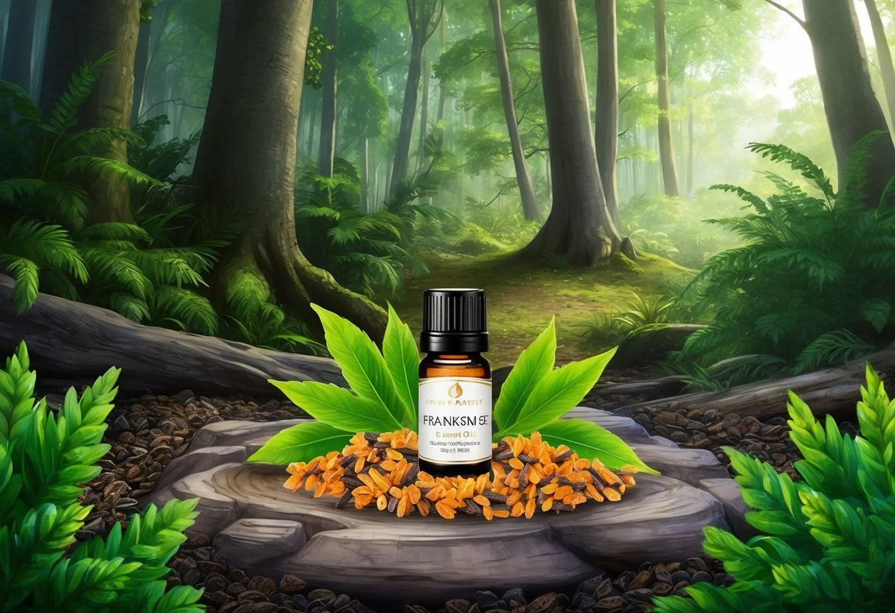
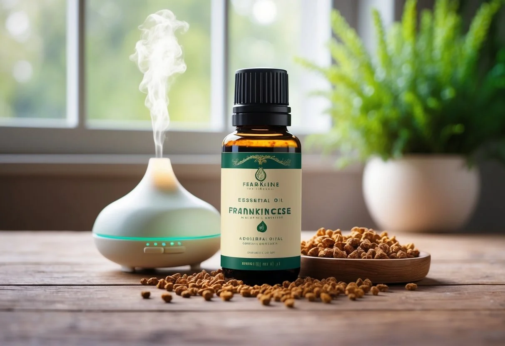

+++
title = "Les bienfaits et l'utilisation de l'huile essentielle d'encens : guide complet pour une aromathérapie efficace"
description = "Découvrez les bienfaits de l'huile essentielle d'encens : apaisante, cicatrisante et idéale pour la méditation. Un allié naturel pour le corps et l'esprit !"
date = 2025-03-12
draft = false
[taxonomies]
tags = ["Encens", "Oliban", "Anti-âge", "Anti-inflammatoire", "Cicatrisation", "ÉquilibreÉmotionnel", "Spiritualité", "Purification", "SystèmeRespiratoire", "Rides", "SoinsVisage", "Rhumatismes", "BienfaitsNaturels", "Massage", "DéveloppementPersonnel", "Sérénité"]
+++

L'[huile essentielle d'encens](https://jardinessentiel.fr/fr/tags/huileessentielle/), également connue sous le nom d'oliban, est un trésor aromatique aux multiples vertus.

Extraite de la résine de l'arbre Boswellia, cette huile est appréciée depuis des millénaires pour ses propriétés apaisantes et thérapeutiques.

**L'huile essentielle d'encens aide à combattre l'anxiété, réduit les tensions nerveuses et favorise un sommeil réparateur tout en soutenant le système immunitaire.**

Cette huile précieuse offre également des bienfaits pour la peau, notamment pour atténuer les rides et ridules, et peut être utilisée pour soigner les petites plaies grâce à ses propriétés [anti-inflammatoires](https://doterra.me/ZRXT4P).

En diffusion, elle crée une atmosphère propice à la méditation et au [développement spirituel](https://www.pharma-gdd.com/fr/guide-huiles-essentielles/huile-essentielle-d-encens-oliban), permettant de se recentrer et de travailler sur soi.

### Points clés

* L'huile essentielle d'encens soulage les [troubles nerveux et respiratoires](https://www.passeportsante.net/fr/Solutions/HuilesEssentielles/Fiche.aspx?doc=huile-essentielle-encens) tout en renforçant l'immunité.
* Ses propriétés anxiolytiques et spasmolytiques en font un allié précieux pour le bien-être émotionnel.
* L'encens oliban est traditionnellement utilisé contre les [angoisses, l'anxiété et les problèmes cutanés](https://doterra.me/ZRXT4P) comme les rides.

## Qu'est-ce que l'huile essentielle d'encens?

L'[huile essentielle](https://jardinessentiel.fr/fr/tags/santenaturelle/) d'encens, aussi connue sous le nom d'oliban, est extraite de la résine d'arbres du genre Boswellia. Elle est reconnue pour ses nombreuses [propriétés thérapeutiques](https://jardinessentiel.fr/tags/essential-oils-for-relaxation/) et son parfum caractéristique.

### Origine et botanique

L'encens ou oliban provient principalement des arbres de la famille des Burséracées, notamment le Boswellia carterii et le Boswellia serrata.

Ces arbres poussent dans des régions arides comme la Somalie, l'Éthiopie, le Yémen et l'Inde.

Le Boswellia est un arbre robuste qui peut atteindre 4 à 8 mètres de hauteur. Sa particularité réside dans sa capacité à produire une résine odorante lorsque son écorce est incisée.

Cette résine, sous forme de larmes jaunâtres ou ambrées, est récoltée manuellement selon des techniques traditionnelles. Elle durcit au contact de l'air et dégage un parfum caractéristique.

La récolte de la résine d'oliban est pratiquée depuis plus de 5000 ans, ce qui fait de l'encens l'une des substances aromatiques les plus anciennes utilisées par l'homme.

### Extraction et caractéristiques

L'huile essentielle d'encens est obtenue par distillation à la vapeur d'eau de la résine d'oliban.

Ce processus permet d'extraire les principes actifs contenus dans la résine.

Le rendement d'extraction est assez faible, ce qui explique le prix relativement élevé de cette huile essentielle. Il faut environ 5 à 10 kg de résine pour obtenir 1 kg d'huile essentielle.

L'huile essentielle d'encens est un liquide jaune pâle à ambré avec une odeur boisée, résineuse et légèrement citronnée.

Sa composition chimique est complexe et comprend principalement des monoterpènes et des sesquiterpènes.

Les analyses par chromatographie montrent que ses [composants majeurs](https://www.voshuiles.com/ressource/huile-essentielle-d-encens/huile-essentielle-d-encens) sont l'α-pinène, le limonène et le myrcène. Ces molécules sont responsables de ses propriétés thérapeutiques.

Pour garantir sa qualité, l'huile essentielle d'encens doit être 100% pure et naturelle, sans additifs ni diluants, et répondre aux normes HECT (Huile Essentielle Chémotypée).

## Les bienfaits thérapeutiques

L'huile essentielle d'encens, aussi connue sous le nom d'oliban, possède de nombreuses propriétés médicinales reconnues. Ses composés actifs en font un allié précieux pour la santé tant physique que psychique.

### Pour la peau

L'huile essentielle d'encens est particulièrement cicatrisante cutanée et offre des résultats remarquables pour les soins de la peau.

Elle est idéale pour les peaux sèches, matures ou abîmées.

En cosmétique naturelle, elle aide à :

* Régénérer les tissus cutanés
* Atténuer les cicatrices
* Réduire les signes du vieillissement
* Apaiser les irritations mineures

Son action régénératrice est appréciée dans les formulations anti-âge. Pour l'utiliser, il suffit de diluer quelques gouttes dans une huile végétale (argan, jojoba) à 2-3% et d'appliquer sur les zones concernées.

### Pour le système respiratoire

Reconnue pour ses propriétés [expectorantes](https://www.naturactive.fr/plantes-actifs/encens-ou-oliban?srsltid=AfmBOorUVtGjcd2vzu3OmgC_mCprPXvnv2pKVTY5urejJy41RRR41MNS), l'huile essentielle d'encens soutient efficacement le système respiratoire.

Elle est particulièrement utile pour apaiser les infections respiratoires.

Elle agit comme :

* **Anticatarrhale** : diminue la production excessive de mucus
* **Expectorante** : facilite l'élimination des sécrétions bronchiques
* **Soutien des défenses naturelles** face aux agressions microbiennes

La diffusion atmosphérique est une méthode efficace pour bénéficier de ses bienfaits respiratoires.

Environ 5-6 gouttes dans un diffuseur pendant 30 minutes assainissent les voies respiratoires et l'environnement.

### Propriétés psycho-émotionnelles

L'huile essentielle d'encens est reconnue pour ses effets profonds sur l'équilibre émotionnel. Elle est antidépressive et aide à lutter contre différents troubles psycho-émotionnels.

Elle favorise :

* La sérénité et la méditation
* La diminution de l'anxiété et du stress
* Le recentrage sur soi
* Le développement spirituel

Utilisée en cas d'épuisement nerveux ou de burn-out, elle apporte réconfort et relaxation.

### Bienfaits pour la douleur

Les propriétés anti-inflammatoires et antalgiques de cette huile essentielle en font un remède naturel contre diverses douleurs.

Elle est particulièrement efficace pour soulager :

* Les douleurs articulaires
* Les rhumatismes
* Les inflammations musculaires
* Les tensions chroniques

Pour l'utiliser contre les douleurs, il convient de la diluer à 5% dans une huile végétale neutre (15 gouttes d'HE pour 10 ml d'huile végétale) et de masser doucement les zones douloureuses.

Son action dénoue les tensions nerveuses et procure un soulagement progressif mais durable.

## Utilisations pratiques de l'huile

L'[huile essentielle d'encens](https://doterra.me/ZRXT4P) offre une multitude d'applications tant pour le bien-être physique que mental.

Elle s'intègre facilement dans diverses routines quotidiennes grâce à ses propriétés polyvalentes.

### En aromathérapie

L'huile essentielle d'encens s'utilise efficacement en diffusion atmosphérique pour purifier l'air et créer une ambiance apaisante.

Pour ce faire, versez 5 à 6 gouttes dans un diffuseur électrique pendant 30 minutes.

En application cutanée, elle doit toujours être diluée dans une huile végétale (5% maximum) :

* Pour les [soins anti-âge](https://jardinessentiel.fr/fr/benefits-and-usage-of-lavender-essential-oil/) : 2 gouttes dans 10 ml d'huile d'argan
* Pour les problèmes respiratoires : 3 gouttes mélangées à 15 ml d'huile de jojoba

Son action anticatarrhale et expectorante est précieuse en cas de bronchite.

Appliquez quelques gouttes diluées sur la poitrine en massage circulaire.

L'usage par inhalation sèche (2-3 gouttes sur un mouchoir) peut aider à combattre la fatigue et favoriser le sommeil.

### Applications méditatives et spirituelles

L'encens est traditionnellement lié aux pratiques spirituelles depuis des millénaires.

Son huile essentielle favorise la méditation et l'élévation spirituelle grâce à son parfum profond et subtil.

Pour une séance de méditation optimale :

* Diffusez 4-5 gouttes dans votre espace de pratique 10 minutes avant de commencer
* Respirez profondément et régulièrement pour synchroniser votre respiration avec l'arôme

Son odeur boisée et chaude crée une atmosphère propice au recueillement.

Elle peut également être utilisée lors de séances de yoga pour approfondir la pratique et maintenir la concentration.

En cas d'[angoisse](https://www.compagnie-des-sens.fr/huile-essentielle-encens/), la diffusion de cette huile apporte un soutien émotionnel significatif en apaisant l'esprit et en favorisant une sensation de sécurité intérieure.

### Synergie avec d'autres huiles

L'huile essentielle d'encens révèle tout son potentiel lorsqu'elle est associée à d'autres huiles essentielles.

Ces combinaisons amplifient ses bienfaits et créent des mélanges aux propriétés spécifiques.

**Synergies recommandées :**

1. **Pour la relaxation profonde** : 2 gouttes d'encens + 3 gouttes de [lavande vraie](https://jardinessentiel.fr/fr/benefits-and-usage-of-lavender-essential-oil/)
2. **Pour la respiration** : 2 gouttes d'encens + 2 gouttes d'eucalyptus citronné
3. **Pour l'énergie** : 2 gouttes d'encens + 2 gouttes de lemongrass

Pour les douleurs articulaires, combinez-la avec la gaulthérie couchée dans une huile végétale (2 gouttes de chaque pour 10 ml). Cette préparation offre un effet anti-inflammatoire renforcé.

En diffusion, un mélange harmonieux consiste en 3 gouttes d'encens et 3 gouttes de bergamote pour créer une atmosphère à la fois apaisante et dynamisante.

## Conseils pour l'utilisation sécurisée

L'utilisation de l'huile essentielle d'encens nécessite certaines précautions pour éviter tout risque pour la santé.

Voici les recommandations essentielles pour profiter de ses bienfaits en toute sécurité.

### Précautions d'emploi

L'huile essentielle d'encens oliban est déconseillée aux femmes enceintes ou allaitantes, ainsi qu'aux enfants de moins de 6 ans.

Les personnes sous traitement médical ou souffrant d'épilepsie devraient consulter un professionnel de santé avant utilisation.

Il est recommandé de toujours diluer cette huile dans une huile végétale avant application cutanée.

La concentration idéale est de 2 gouttes d'huile essentielle pour 5 gouttes d'huile végétale.

En cas de réaction allergique (rougeur, démangeaison), cessez immédiatement l'utilisation et rincez abondamment à l'eau claire.

Un test cutané préalable est conseillé sur une petite zone de peau.

Pour une utilisation thérapeutique, privilégiez une huile essentielle d'encens **HEBBD** (Huile Essentielle Botaniquement et Biochimiquement Définie) qui garantit sa qualité et sa pureté.

### Comment utiliser les compte-gouttes

Le compte-gouttes intégré au flacon d'huile essentielle d'encens permet un dosage précis, essentiel pour une utilisation sécuritaire.

Pour prélever correctement l'huile :

* Tenez le flacon à la verticale
* Appuyez légèrement sur la poire du compte-gouttes
* Relâchez doucement pour aspirer l'huile
* Comptez les gouttes une par une

Ne touchez jamais directement la peau avec le compte-gouttes pour éviter toute contamination du produit.

[L'application cutanée doit se limiter à 1 ou 2 gouttes maximum](https://www.pharmashopi.com/huile-essentielle-encens-pxl-178_458_539.html?srsltid=AfmBOorlurLJgToVnRiHeZnbDNSuNlFLYCCYdrwr6uP-bhZ5PMCjEVta) mélangées à une huile végétale.

Conservez le flacon hors de portée des enfants, bien fermé après chaque utilisation, dans un endroit frais et sec pour préserver ses propriétés.

## L'huile d'encens dans la culture populaire

L'huile essentielle d'encens occupe une place privilégiée dans diverses traditions culturelles depuis des millénaires.

Cette substance précieuse est vénérée tant pour ses propriétés spirituelles que pour ses bienfaits en cosmétique.

### Histoire et symbolisme

L'encens, également connu sous le nom d'oliban, possède une riche histoire remontant à l'Égypte ancienne et aux civilisations de Mésopotamie.

Cette résine aromatique était considérée comme un cadeau précieux, comparable à l'or, comme en témoigne son apparition parmi les offrandes des Rois mages dans la tradition chrétienne.

Originaire principalement de Somalie et du Moyen-Orient, l'arbre à encens (Boswellia) produit une résine qui, une fois distillée, donne cette huile aux propriétés remarquables.

Elle était souvent utilisée avec la myrrhe dans les [rituels religieux](https://jardinessentiel.fr/fr/tags/aromatherapie/).

Dans de nombreuses traditions spirituelles, l'encens symbolise la purification et l'élévation de l'âme.

Son parfum boisé et profond favorise les états méditatifs et crée une atmosphère propice à la contemplation.

### L'encens dans les soins de beauté

L'[huile essentielle d'encens](https://doterra.me/ZRXT4P) est devenue un ingrédient prisé dans l'industrie cosmétique moderne. Son pouvoir raffermissant sur la peau en fait un allié précieux contre les signes du vieillissement cutané.

Riche en composés actifs, elle aide à :

* Régénérer les cellules cutanées
* Tonifier les peaux matures
* Atténuer les cicatrices et imperfections

Les formulations à base d'encens sont particulièrement appréciées pour les soins anti-âge. Elles aident à maintenir l'élasticité de la peau tout en apportant un éclat naturel au teint.

Dans les routines beauté contemporaines, on la retrouve dans des sérums, crèmes et huiles de massage haut de gamme.

Son parfum subtil ajoute une dimension sensorielle aux soins, créant une expérience à la fois physique et émotionnelle.
