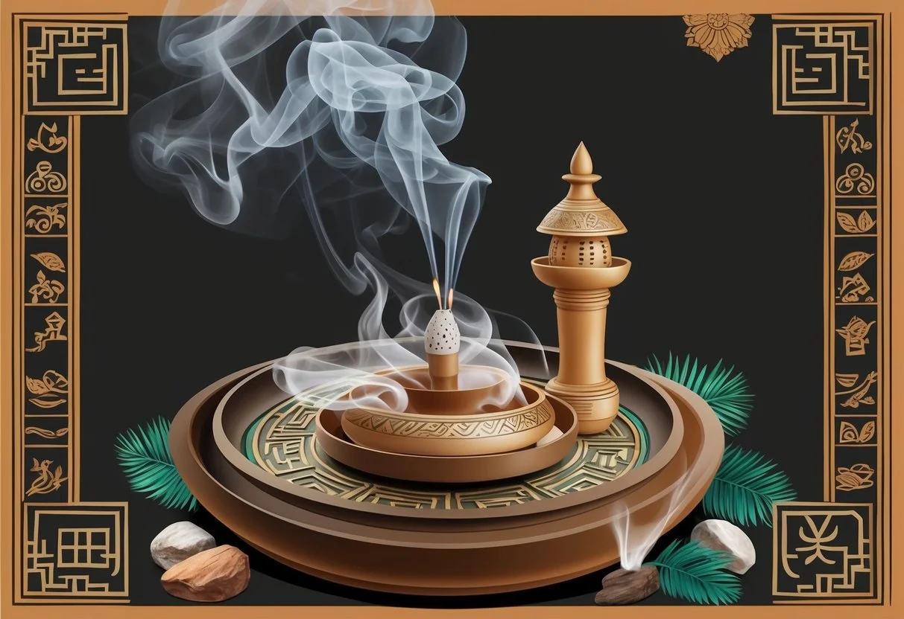
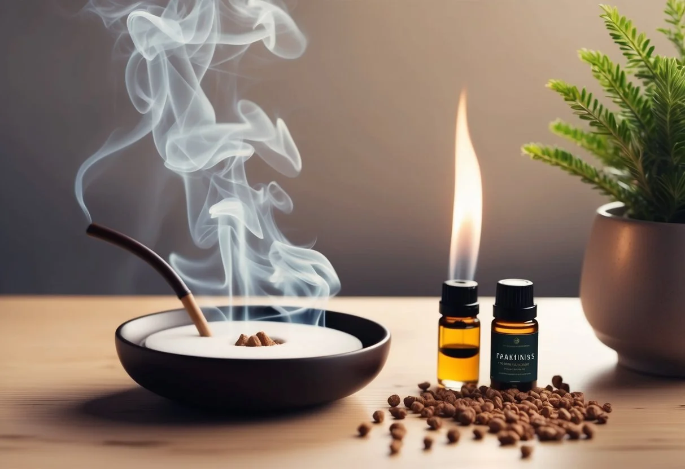

+++
title = "A tömjén illóolaj kedvező hatásai és használata: 5 meggyőző módszer a mindennapokban"
description = "Fedezd fel a tömjén illóolaj jótékony hatásait! 🌿 Csökkentsd a stresszt, erősítsd immunrendszered és támogasd érzelmi egyensúlyod természetesen."
date = 2025-03-12
draft = false
[taxonomies]
tags = ["mentális jólét", "bőrfiatalítás", "nyugalom és relaxáció", "illóolaj hatások", "szorongásoldás", "antifungális hatás", "stresszcsökkentés", "feszültségoldás", "bőrápolás természetesen", "bőrnyugtató", "mentális tisztulás", "szakértői aromaterápia", "természetes stresszoldás", "illatkeverékek", "levegőtisztító hatás", "édes illatok", "mood booster", "nyugtató aromaterápia", "citrus illatok", "antioxidáns hatás", "természetes gyógyír", "tudatos relaxáció"]
+++

A tömjén illóolaj az egyik legértékesebb és legtöbbre becsült esszenciális olaj, amely évezredek óta fontos szerepet játszik különböző kultúrákban. Ez a csodálatos olaj nemcsak kellemes, fás-fűszeres illatával nyűgöz le, hanem számtalan jótékony hatással is rendelkezik az egészségre és a jólétre.

**A tömjénolaj kiváló [stresszcsökkentő](https://jardinessentiel.fr/hu/tags/stresszkezeles/) tulajdonságokkal bír, javítja az immunrendszer működését, és támogatja az [érzelmi egyensúly](https://jardinessentiel.fr/hu/tags/erzelmi-egyensuly/)t.**

Az aromaterápia világában a tömjén olajat gyakran az "illóolajok jokerének" nevezik sokoldalú felhasználhatósága miatt. Belélegezve csökkentheti a pulzusszámot és a magas vérnyomást, ahogy azt [kutatások is alátámasztják](https://regosvolgyiregina.hu/szakralis-olajok-a-tomjen/).

A minőségi termékek, mint például a [doTERRA tömjén illóolaja](https://doterra.me/sENfI8), tisztán is alkalmazhatók a bőrön, és aromatikusan is használhatók a mindennapi nyugalom megteremtéséhez.

### Legfontosabb tudnivalók

* A tömjénolaj hatékonyan csökkenti a stresszt és a negatív érzelmeket, segítve a belső harmónia megteremtését.
* Az illóolaj gyulladáscsökkentő hatással rendelkezik és erősíti a bőrt, miközben támogatja az immunrendszert.
* A tömjén aromaterápiás alkalmazása [elősegíti a pihenést és az érzelmi egyensúlyt](https://megoldasmaskepp.hu/2021/06/23/tomjenolaj-elosegiti-a-pihenest-es-tamogatja-az-erzelmi-egyensulyt/), javítva az általános életminőséget.

## A tömjén története és eredete

A tömjén az emberiség egyik legrégebbi és legértékesebb növényi terméke, amelynek története évezredekre nyúlik vissza. A tömjénfa gyantája fontos szerepet játszott számos ősi kultúrában vallási szertartásoktól a gyógyításig.

### Boswellia fa és gyantájának története

A tömjén a [Boswellia nemzetségbe tartozó fafajok](https://hu.wikipedia.org/wiki/T%C3%B6mj%C3%A9n) gyantájából származik, amelyek főként Északkelet-Afrikában és Délnyugat-Ázsiában honosak. Az ókori egyiptomiak már Kr. e. 3000 körül használták vallási szertartásaikban és balzsamozáshoz.

A tömjén kereskedelme az ókorban virágzott. Az úgynevezett "tömjénút" fontos kereskedelmi útvonal volt, amely Arábiától a Földközi-tengerig húzódott. A gyantát a fa kérgének megvágásával nyerték, majd az abból kifolyó anyag megszilárdulása után gyűjtötték össze.

A rómaiak is nagyra értékelték a tömjént, és súlyát gyakran aranyban mérték. Az értékes gyanta kereskedelme jelentős gazdasági tényező volt az ókori világban, és hozzájárult teljes királyságok gazdagságához.

### A tömjén kulturális jelentősége

A tömjénnek kiemelkedő vallási jelentősége van számos kultúrában. A keresztény hagyományban az arany, tömjén és mirha a három napkeleti bölcs ajándékai Jézus születésekor, ami jelzi a [tömjén különleges értékét](https://www.evamagazin.hu/otthonom/mirha-tomjen-illoolaj-hasznalata).

A tömjén füstölése szent szertartások részét képezte az ókori Egyiptomban, Görögországban és Rómában. A füst felszállását gyakran az imák istenekhez való felemelkedésének szimbólumaként értelmezték.

A buddhista és hindu hagyományokban szintén fontos szerepet tölt be a tömjén. Ezekben a kultúrákban a meditáció elősegítésére és a szent terek megtisztítására használják. Mai napig megtalálható templomokban és vallási szertartásokon világszerte.

A tömjénfa gyantáját évezredek óta használják [gyógyászati célokra](https://jardinessentiel.fr/hu/tags/termeszetes-gyogymod/) is, ami tovább növeli kulturális jelentőségét és értékét.

## Tömjén illóolaj előnyei

A tömjén illóolaj számos jótékony hatással rendelkezik, amelyek a bőrápolástól a lelki egyensúly megteremtéséig terjednek. Ez az értékes olaj természetes módon támogatja a szervezet működését és javítja az életminőséget.

### Bőrápolási előnyök

A tömjén illóolaj kiemelkedő előnyökkel bír a bőrápolás területén. [Bőrfiatalító hatása](https://www.illoolajok.hu/illoolajok-hatasai/a-tomjen-illoolaj-30-zsenialis-felhasznalasi-modja.html) révén csökkenti a finom ráncokat és javítja a bőr textúráját. Elég 1-2 cseppet a hidratálókrémhez adni a legjobb eredmény érdekében.

A tömjén [erősíti a bőrt és növeli annak rugalmasságát](https://regosvolgyiregina.hu/szakralis-olajok-a-tomjen/), miközben védelmet nyújt a baktériumok ellen. Különösen hatékony a hegek kezelésében, hígítva közvetlenül alkalmazható a problémás területeken.

Rendszeres használatával a bőr ragyogóbbá és egészségesebbé válik. Segít a bőrhibák, foltok elleni védelemben is, így ideális választás azoknak, akik természetes megoldást keresnek a bőrproblémáikra.

### Egészséges immunrendszer támogatása

A tömjén illóolaj erős antibakteriális tulajdonságokkal rendelkezik, amelyek segítenek megelőzni és kezelni különböző fertőzéseket. Hatékonyan alkalmazható szájfertőzések és ínygyulladás kezelésére is.

Természetes fertőtlenítő hatása miatt kiváló kiegészítője lehet az immunrendszer támogatásának, különösen a megfázásos időszakokban.

Párologtatóban használva tisztítja a levegőt és csökkenti a kórokozók számát.

**Alkalmazási módok az immunrendszer erősítésére:**

* Párologtatóban 3-4 csepp
* Mellkason bedörzsölve, hordozóolajjal hígítva
* Inhalálás forró vízbe cseppentve

### Lelki egyensúly és relaxáció

A tömjén illóolaj nyugtató hatása kiemelkedő, segít csökkenteni a stresszt és a szorongást.

Évszázadok óta használják meditációhoz és spirituális gyakorlatokhoz.

Az illóolaj elősegíti a pihenést és támogatja az érzelmi egyensúlyt.

Nyugtató aromája segít lecsendesíteni az elmét és elmélyíteni a légzést.

**Relaxációs felhasználási módok:**

* Esti fürdővízhez 4-5 csepp
* Párologtatóban alvás előtt
* Tenyérbe cseppentve, belélegezve stresszes helyzetekben

Rendszeres használata segít kialakítani egy kiegyensúlyozottabb érzelmi állapotot.

Különösen ajánlott azoknak, akik gyakran éreznek feszültséget vagy nehezen kapcsolódnak ki a mindennapi stressz után.

## Tömjén illóolaj alkalmazásai

A [tömjénolaj](https://doterra.me/sENfI8) az egyik legsokoldalúbb illóolaj, amely számos területen hatékonyan alkalmazható.

Az alábbiakban megismerhetjük a legfontosabb felhasználási módokat, amelyek a mindennapi életben segíthetnek.

### Aromaterápiás használat

A tömjén illóolaj kiváló választás [aromaterápiás célokra](https://jardinessentiel.fr/hu/tags/aromaterapia/).

Párologtatóba cseppentve csökkenti a stresszt és szorongást, valamint elősegíti az érzelmi egyensúly megteremtését.

Naponta 3-5 csepp elegendő egy átlagos méretű helyiség illatosításához.

A [doTERRA tömjén illóolaj](https://doterra.me/sENfI8) különösen hatékony, mert lassítja és mélyíti a légzést, ezáltal [nyugtató hatást fejt ki](https://jardinessentiel.fr/hu/tags/nyugtato-hatas/).

Az aromaterápiás használat során kombinálható más illóolajokkal is, például levendulával vagy citrusfélékkel. Ez fokozhatja a relaxációs hatást és kellemes atmoszférát teremt az otthonban.

Alvási problémák esetén érdemes lefekvés előtt 30 perccel elindítani a párologtatót tömjénolajjal, ami segíti a pihentető alvást.

### Bőrápolási rutinok

A tömjén illóolaj gyulladáscsökkentő és antibakteriális hatása miatt kitűnő bőrápolási összetevő.

Hordozóolajjal keverve (például mandula- vagy jojoba olajjal) közvetlenül a bőrre is alkalmazható.

**Bőrápolási receptek tömjénolajjal:**

* *Fiatalító arcszérum*: 30 ml jojoba olaj + 5 csepp tömjén illóolaj
* *Hidratáló testápoló*: 50 ml kókuszolaj + 8 csepp tömjén illóolaj
* *Hegkezelő keverék*: 20 ml orbáncfűolaj + 4 csepp tömjén illóolaj

A tömjénolaj hozzájárulhat a hidratált és fiatalos bőrhöz, miközben csökkenti a bőrhibák megjelenését.

Rendszeres használata javíthatja a bőr tónusát és rugalmasságát.

A bőrápolási rutinba napi egyszer érdemes beépíteni, lehetőleg este, amikor a bőr regenerálódik.

### Meditáció és jóga kiegészítése

A tömjén illóolaj tökéletes társ a meditáció és jóga gyakorlásához.

Elősegíti a pihenést és támogatja az érzelmi egyensúlyt, ami mélyítheti a meditációs élményt.

A jógagyakorlatok előtt érdemes a csuklókra és halántékra kenni (hígítva), vagy a gyakorlótérben párologtatni.

A tömjén illata segít a földelésben és a jelenlét megtapasztalásában.

Meditáció során különösen hatékony lehet a tömjénolaj használata légzőgyakorlatokkal kombinálva:

1. Cseppentsen 1-2 csepp olajat a tenyerébe
2. Dörzsölje össze a tenyereit
3. Helyezze kezét az orra elé és lélegezzen mélyeket

A rendszeres gyakorlók szerint a tömjén segít az elme lecsendesítésében és a mélyebb tudatállapotok elérésében.

Különösen hasznos lehet stresszoldó meditációk vagy yin jóga gyakorlatok során.

## Tömjén illóolaj biztonságos használata és óvintézkedések

A tömjén illóolaj megfelelő használata biztonsági óvintézkedéseket igényel.

A helyes hígítás és a lehetséges bőrreakciók figyelembe vétele elengedhetetlen, valamint fontos megismerni, hogyan kombinálható más illóolajokkal.

### Hígítás és bőrérzékenység

Az illóolajok, beleértve a tömjént is, erősen koncentrált anyagok, amelyeket használat előtt hígítani kell.

A tömjén illóolajat soha ne alkalmazzuk közvetlenül a bőrre, mindig keverjük növényi olajjal vagy macerátummal.

A javasolt arány általában 2-3% (2-3 csepp illóolaj 5 ml hordozóolajhoz).

Bőrpróba végzése ajánlott az egyéni érzékenység kiszűrésére.

Ehhez kenjünk kis mennyiségű, már hígított olajat a csuklóra vagy könyökhajlatba, és figyeljük 24 órán keresztül.

Bizonyos egyéneknél a tömjén illóolaj émelygést okozhat, különösen ha helytelenül használják.

Várandósok, szoptató anyák és gyermekek esetében különös óvatosság szükséges.

### Interakciók más illóolajokkal

A tömjén illóolaj jól kombinálható számos más illóolajjal, ami fokozhatja jótékony hatásait.

Különösen harmonikus párosítást alkot a [citrusféle illóolajokkal](https://jardinessentiel.fr/hu/tags/bergamott-illoolaj/), mint a narancsolaj, bergamott és vadnarancs.

A DoTerra és más minőségi illóolaj-gyártók gyakran keverik a tömjént ciprus illóolajjal is, ami nyugtató hatást eredményez.

Keverékek készítésekor érdemes betartani a 30 cseppet nem meghaladó teljes mennyiséget 10 ml hordozóolajra számítva.

A tömjén mellék- és kölcsönhatásai más anyagokkal nem széles körben ismertek, de óvatosságból kerüljük az erősen irritáló hatású illóolajokkal való kombinálást, különösen érzékeny bőr esetén.

Az illóolaj-keverékeket mindig jól szellőző helyen készítsük el, és tároljuk sötét üvegben, hűvös helyen.

## Illóolaj vásárlási tanácsok

Az [illóolajok](https://jardinessentiel.fr/hu/tags/illoolaj-eloallitasa/) vásárlásánál fontos szempontokat kell figyelembe venni a hatékonyság és minőség biztosítása érdekében.

A megfelelő termék kiválasztása közvetlen hatással van az olaj által nyújtott előnyökre.

### Tisztaság és minőség felismerése

A minőségi tömjén illóolaj felismeréséhez először ellenőrizze a címkét.

A tiszta termékeken a latin név (Boswellia) mindig fel van tüntetve.

Keressen olyan jelzéseket, mint a "100% tiszta" vagy "terápiás minőségű" a csomagoláson.

A [minőségi illóolajok](https://doterra.me/sENfI8) üvege sötét színű, ami védi a tartalmat a fénytől.

Az ár is jelzésértékű – a túl olcsó termékek gyakran hígítottak vagy szintetikus összetevőket tartalmaznak.

Megbízható forrásból vásároljon, amely részletes információt nyújt a termék eredetéről és az előállítás módjáról.

A teszteredmények vagy a gázkromatográfiás vizsgálatok nyilvános elérhetősége a gyártó átláthatóságát jelzi.

Az illat tesztelése is fontos – a valódi tömjén illóolaj földes, fás, enyhén fűszeres illattal rendelkezik, amely nem szúrós vagy kémiai jellegű.

### A legjobb tömjén illóolaj kiválasztása

A tömjén illóolajának több fajtája létezik, ezek közül a *Boswellia carterii* és a *Boswellia serrata* a legelterjedtebb.

A felhasználási céltól függően más-más fajta lehet ideális.

A minősítések és tanúsítványok segítenek a választásban.

Keresse a BIO vagy organikus jelölést, ha vegyszermentes terméket szeretne. A fenntartható forrásból származó olajok környezettudatos választást jelentenek.

A frankincense néven is ismert tömjén népszerű márkái között találjuk a megbízható forgalmazókat, akik átlátható információkat közölnek a származási helyről.

A hidegen sajtolt vagy gőzdesztillált termékek magasabb minőséget képviselnek.

Figyelje a kiszerelést is – a kisebb mennyiségek frissebben tarthatók, így kezdőknek ideálisak a 5-10 ml-es üvegek.

Érdemes figyelembe venni a cseppentő minőségét is a pontos adagolás érdekében.

## Kreatív felhasználási módok és DIY projektek

A tömjén illóolaj sokoldalúsága lehetővé teszi, hogy otthon készült termékekben és mindennapi tárgyakban is hasznosíthassuk.

Ez az értékes olaj nemcsak jótékony hatásai miatt kedvelt, hanem kellemes aromája révén is.

### Illóolajos szappanok és szépségápolási termékek

A tömjén illóolaj kiváló alapanyag házi készítésű [szépségápolási termékekhez](https://www.illoolajok.hu/illoolajok-hatasai/a-tomjen-illoolaj-30-zsenialis-felhasznalasi-modja.html).

Különösen népszerű a szappankészítésben, ahol 5-10 csepp elegendő egy adag szappanhoz.

**Házi hidratáló krém receptje:**

* 50 ml shea vaj
* 30 ml kókuszolaj
* 20 ml jojobaolaj
* 8-10 csepp tömjén illóolaj

A tömjén különösen előnyös az érett bőr ápolásában. Házi készítésű arctonikba keverve segít a bőr tónusának javításában és a finom ráncok csökkentésében.

Fürdősók készítéséhez keverjünk össze 1 csésze epsom sót, 1/2 csésze sütőszódát és 15 csepp tömjén illóolajat.

Ez a keverék nyugtató fürdőélményt nyújt és támogatja a bőr regenerálódását.

### Aromaékszerek és párologtatás

Az aromaékszerek praktikus módjai a tömjén illóolaj egész napos használatának.

Ezek lehetnek medálok, karkötők vagy diffúzor gyűrűk, amelyek lassan párologtatják az illóolajat.

**Népszerű párologtatási módszerek:**

1. Elektromos diffúzor: 4-5 csepp olaj 100 ml vízhez
2. Kerámia párologtató: 3-4 csepp olajat cseppentsünk a mélyedésbe
3. Illóolajos mécsestartó: 5-6 csepp olaj és víz kombinációja

A [tömjén](https://doterra.me/sENfI8) párologtatva kiváló a meditációhoz és a relaxációhoz. A nyugtató hatás fokozásához érdemes [levendulával](https://jardinessentiel.fr/hu/benefits-and-usage-of-lavender-essential-oil/) vagy [bergamottal](https://jardinessentiel.fr/hu/benefits-and-usage-of-bergamot-essential-oil/) kombinálni.

Egyszerű légtisztító spray készíthető 50 ml desztillált vízből, 50 ml alkoholból és 20 csepp tömjén illóolajból.

Ez a keverék frissíti a levegőt és kellemes aromát biztosít az otthonban.
