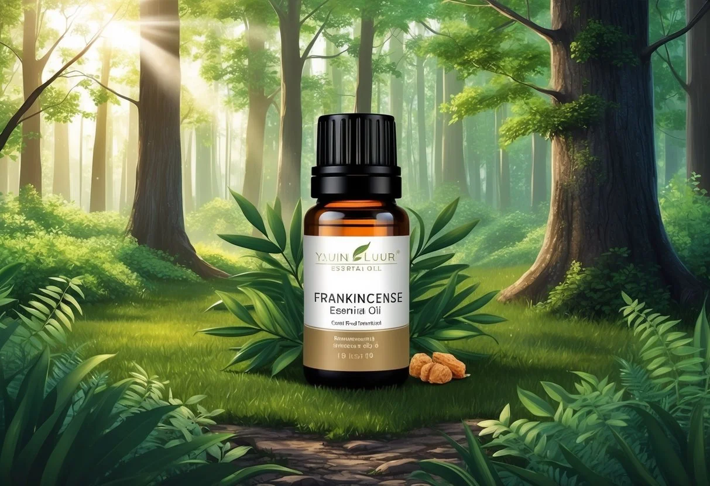

+++
title = "Benefits and Usage of Frankincense Essential Oil: Ancient Remedy for Modern Wellness"
description = "Discover the benefits of frankincense essential oil—reduce inflammation, boost immunity, and enhance skin health with this ancient natural remedy!"
date = 2025-03-12
draft = false
[taxonomies]
tags = ["Aromatherapy for anxiety", "Aromatherapy for better sleep", "Aromatherapy for skin care", "Aromatherapy for stress relief", "Benefits of essential oils", "Bergamot oil for mood enhancement", "Essential oils for emotional well-being", "Essential oils for hair care", "Essential oils for mental clarity", "Essential oils for wellness", "Holistic self-care", "Lavender oil benefits", "Natural anxiety relief", "Natural mood boosters", "Relaxation techniques with essential oils", "Skin benefits of essential oils", "Tea tree oil benefits", "Therapeutic essential oils"]
+++

Frankincense essential oil comes from the resin of Boswellia trees and has been valued for thousands of years. This aromatic substance appears in ancient texts and traditions across many cultures, where it was used in religious ceremonies and for healing.

Today, people still prize frankincense for its unique woody scent and potential health benefits.

**Frankincense oil may help reduce inflammation, boost immunity, and improve [skin health](https://jardinessentiel.fr/tags/essential-oils-for-skin/) when used properly.**

Studies suggest it contains compounds that [stop inflammation](https://www.webmd.com/diet/health-benefits-frankincense-essential-oil) in the body.

Many people use it to help manage conditions like [arthritis and asthma](https://www.healthline.com/nutrition/frankincense), though more research is needed to fully confirm these effects.

You can use frankincense oil in diffusers, as a skin treatment when diluted with carrier oils, or in homemade cleaning products.

Its versatility makes it popular in aromatherapy where it's known to [lift mood](https://nikura.com/blogs/essential-oils/benefits-and-uses-of-frankincense-oil) and create a [calming atmosphere](https://jardinessentiel.fr/tags/essential-oils-for-relaxation/).

The oil blends well with citrus and other woody scents for a pleasant aromatic experience.

### Key Takeaways

* Frankincense essential oil contains anti-inflammatory properties that may help reduce pain and swelling in conditions like arthritis.
* The oil can be used in aromatherapy, skincare routines, and household applications for both fragrance and potential health benefits.
* [Quality frankincense oil](https://doterra.me/fBGs5g) should be sourced from sustainable Boswellia species and stored properly in dark glass containers away from heat and sunlight.

## Historical Context of Frankincense

Frankincense has played a significant role throughout human civilization for thousands of years, valued for its aromatic properties and cultural importance. Its history spans multiple continents and has shaped trade routes across ancient worlds.

### Cultural Significance

Frankincense, also known as olibanum, has held deep religious importance in many cultures.

Ancient Egyptians used this fragrant resin extensively in their religious ceremonies and to [preserve dead bodies as mummies](https://www.laphamsquarterly.org/roundtable/brief-history-frankincense). The resin was considered so valuable that it was often presented as a gift to royalty.

In Abrahamic religions, frankincense became a sacred substance. It appears in biblical texts as one of the gifts brought to the infant Jesus.

The resin is still [used in religious buildings](https://en.wikipedia.org/wiki/Frankincense) for purification ceremonies today.

Its distinctive aroma made it a symbol of divinity and spiritual connection. Many ancient cultures believed frankincense smoke carried prayers to the heavens.

### Ancient Trade and Use

The frankincense trade created vast commercial networks connecting Arabia, North Africa, and the Mediterranean.

Somalia and parts of the Arabian Peninsula were primary sources of this precious resin, with trees of the Boswellia genus carefully harvested by skilled workers.

Caravans transported frankincense along with myrrh and other valuable commodities across deserts, creating prosperity for regions controlling these trade routes.

The resin was [used throughout history](https://www.vinevida.com/blogs/our-blog/a-brief-history-of-frankincense-essential-oil-and-its-uses) not only in religious rituals but also as medicine.

Ancient healers recognized frankincense's [antiseptic properties](https://pubmed.ncbi.nlm.nih.gov/27117114/) and used it to treat various ailments.

Greek and Roman physicians prescribed it for everything from digestive problems to battlefield wounds.

This early form of aromatherapy laid the foundation for frankincense's continued use in traditional medicine practices across cultures.

## Botanical Profile and Extraction

Frankincense oil comes from several species of the Boswellia tree, which produces aromatic resin that is harvested and processed through specific methods to extract its essential compounds. The quality and properties of the oil vary based on the species, harvesting techniques, and extraction processes used.

### Boswellia Species

Frankincense is derived from trees in the genus **Boswellia**, which are small deciduous trees native to arid regions. The most prized species include **Boswellia sacra** (found in Oman and Yemen), **Boswellia carteri** (Somalia), and **Boswellia serrata** (India).

Each species produces resin with slightly different chemical compositions.

**Boswellia sacra** is often considered the highest quality source, producing a sweet, warm, and rich fragrance. **Boswellia serrata**, commonly called Indian frankincense, contains higher levels of [boswellic acids](https://www.healthline.com/nutrition/frankincense) that contribute to its anti-inflammatory properties.

The trees typically grow to 2-8 meters tall and have papery, peeling bark. They thrive in rocky, limestone-rich soil in harsh climatic conditions, which contributes to the concentrated nature of their resin.

### Harvesting and Gum Resin

The harvesting of frankincense follows ancient techniques that have remained largely unchanged for thousands of years.

Collectors make precise incisions in the tree bark, causing the tree to exude a milky-white sap that hardens into tears of **gum resin** upon exposure to air.

This process, called "tapping," is typically done 2-3 times per year. The first harvest often yields lower quality resin, while subsequent collections produce [higher quality material](https://www.newdirectionsaromatics.com/blog/pure-incense-an-in-depth-guide-to-frankincense-oil/).

After collection, the resin tears are sorted by color, size, and purity.

Colors range from pale yellow to brown, with lighter colors generally indicating higher quality. The tears are then allowed to dry and cure for several weeks before being prepared for extraction.

Proper harvesting is sustainable when trees are allowed adequate recovery time between tappings, typically 5-6 years of rest after 3 years of harvesting.

### Extraction Processes

The essential oil is primarily obtained through **steam distillation** of the hardened gum resin.

This process involves placing the crushed resin in a still and passing steam through it, which carries the volatile compounds into a condenser.

The steam and oil vapor cool and separate into water and essential oil.

This gentle process preserves the delicate chemical composition of the oil, including its terpenes, sesquiterpenes, and other aromatic compounds.

A typical yield is quite low—about 3-10% oil by weight of resin—making frankincense oil relatively expensive.

The resulting oil is pale yellow to greenish in color with a warm, complex aroma that contains [balsamic, spicy, and woody notes](https://www.aromaweb.com/essential-oils/frankincense-essential-oil.php).

Modern extraction may also use CO2 extraction, which operates at lower temperatures and produces a more complete aromatic profile, though this method is less common and more expensive.

## Therapeutic Properties of Frankincense Oil

Frankincense essential oil contains powerful compounds that offer multiple health benefits. Its therapeutic properties have been valued since ancient times for healing various ailments.

### Anti-Inflammatory and Analgesic Effects

Frankincense oil contains [boswellic acids](https://pubmed.ncbi.nlm.nih.gov/27117114/) that provide significant anti-inflammatory effects.

These compounds inhibit the production of inflammatory molecules in the body, making it helpful for conditions like arthritis and joint pain.

Research indicates that frankincense can reduce inflammation markers while providing natural pain relief.

People often apply diluted frankincense oil topically to inflamed areas to decrease swelling and discomfort.

The oil's anti-inflammatory properties may also help with inflammatory skin conditions.

When properly diluted with a carrier oil, it can soothe irritated skin and reduce redness.

For those with chronic inflammatory conditions, frankincense may offer a complementary approach alongside conventional treatments.

Regular use might help manage long-term inflammation and associated pain.

### Antimicrobial and Antiseptic Qualities

Frankincense oil demonstrates [antiseptic properties](https://pubmed.ncbi.nlm.nih.gov/27117114/) that help fight various pathogens.

It can inhibit the growth of harmful bacteria and certain fungi when applied topically in appropriate dilutions.

The oil creates an unwelcoming environment for microbes, making it useful for minor wound care.

Many natural first aid products incorporate frankincense for its protective qualities.

Its antimicrobial effects extend to oral health applications as well.

Some natural mouthwashes and oral care products include frankincense to help combat bacteria that cause bad breath and gum problems.

Traditional medicine systems have used frankincense to disinfect living spaces.

Today, diffusing the oil can help purify indoor air and potentially reduce airborne pathogens.

### Aromatherapy and the Limbic System

The distinctive aroma of frankincense directly affects the [limbic system](https://www.webmd.com/diet/health-benefits-frankincense-essential-oil), which controls emotions and memories.

When inhaled, the oil's compounds can trigger relaxation responses in the brain.

Studies suggest frankincense aromatherapy may reduce stress hormones like cortisol.

This makes it valuable for managing anxiety and promoting emotional balance during stressful periods.

Many meditation and mindfulness practices incorporate frankincense scent.

Its [calming properties](https://jardinessentiel.fr/benefits-and-usage-of-lavender-essential-oil/) help create an atmosphere conducive to mental clarity and focus.

The oil's [anti-anxiety effects](https://draxe.com/essential-oils/what-is-frankincense/) make it useful for improving sleep quality.

Diffusing frankincense before bedtime can help establish a relaxing pre-sleep routine that signals the body to prepare for rest.

### Supporting Respiratory Health

Frankincense oil works as an [expectorant](https://pubmed.ncbi.nlm.nih.gov/27117114/), helping to clear mucus from the respiratory system.

This makes it beneficial for conditions involving congestion or excess phlegm.

The oil's anti-inflammatory properties also help reduce inflammation in the airways.

People with asthma or bronchitis may find relief when using frankincense in steam inhalation.

Its ability to support deeper breathing makes frankincense popular in breathing exercises.

The oil helps open airways and encourages fuller oxygen intake during respiratory practices.

When diffused, frankincense creates an environment that supports clear breathing.

Many find it helpful during seasonal challenges or when recovering from respiratory infections.

### Evidence in Treating Digestive Disorders

Frankincense demonstrates significant benefits for digestive health issues.

Research shows it can help manage conditions like [diarrhea and vomiting](https://www.health.com/frankincense-8671705) through its [anti-inflammatory properties](https://jardinessentiel.fr/tags/benefits-of-lavender-oil/).

The resin contains boswellic acids that target inflammatory pathways in the digestive system. These compounds may provide relief for people suffering from inflammatory bowel diseases, particularly [ulcerative colitis](https://pubmed.ncbi.nlm.nih.gov/27117114/).

Studies indicate that frankincense supplements can reduce intestinal inflammation and improve gut barrier function.

The traditional practice of chewing frankincense resin to aid digestion now has scientific backing.

For optimal digestive benefits, frankincense is available in various forms:

* Capsule supplements (standardized extracts)
* Essential oils (diluted for massage)
* Teas and infusions

### Potential in Cancer Therapy

Research into frankincense's anticancer properties shows remarkable potential.

The compound AKBA (acetyl-11-keto-β-boswellic acid) demonstrates the ability to induce [apoptosis](https://pmc.ncbi.nlm.nih.gov/articles/PMC9268443/) (programmed cell death) in several cancer cell types.

Laboratory studies reveal frankincense extracts may inhibit cancer cell growth while sparing healthy cells. This selective action makes it particularly interesting for cancer research.

**Key cancer types being studied with frankincense:**

* Breast cancer
* Prostate cancer
* Pancreatic cancer
* Brain tumors

While promising, these findings are primarily from laboratory and animal studies. Clinical trials in humans are still in early stages, and frankincense should not replace conventional cancer treatments.

### Effects on Skin and Anti-Aging

Frankincense offers significant benefits for [skin care](https://www.sciencedirect.com/science/article/abs/pii/S0926669023008713) and anti-aging applications.

Its natural astringent properties help tone and tighten skin, reducing the appearance of wrinkles and fine lines.

The resin's anti-inflammatory compounds soothe irritated skin conditions. It may help reduce redness and swelling associated with acne, eczema, and other inflammatory skin disorders.

Frankincense oil promotes cellular regeneration, which helps maintain skin's elasticity and resilience. Regular application may improve skin's overall texture and appearance.

Many high-end skincare products now incorporate frankincense due to these properties:

* Reduces appearance of scars and stretch marks
* Balances oil production
* Provides natural protection against environmental damage
* Helps maintain skin moisture levels

## Practical Uses of Frankincense Essential Oil

[Frankincense essential oil](https://doterra.me/fBGs5g) offers versatile applications in daily life due to its therapeutic properties and pleasant aroma. This ancient resin extract provides benefits across personal care, wellness routines, and home maintenance.

### In Aromatherapy Practice

Frankincense essential oil works effectively in diffusers where its warm, spicy scent creates a calming atmosphere.

Add 3-5 drops to your diffuser to reduce anxiety and create a peaceful environment for meditation or relaxation.

Inhaling frankincense oil may [boost immune system activity](https://nikura.com/blogs/essential-oils/benefits-and-uses-of-frankincense-oil), helping the body fight off common germs and seasonal threats. This makes it valuable during cold and flu seasons.

For respiratory support, add 2-3 drops to a bowl of hot water and breathe in the steam. This practice helps open airways and soothes irritated respiratory passages.

Blending frankincense with citrus oils like [bergamot](https://jardinessentiel.fr/benefits-and-usage-of-bergamot-essential-oil/) or orange creates an uplifting aromatherapy combination for mental clarity and focus during work or study sessions.

### As Skin Care Ingredient

Frankincense essential oil has gained popularity in skin care for its [anti-aging properties](https://www.webmd.com/diet/health-benefits-frankincense-essential-oil).

When diluted properly, it helps reduce the appearance of fine lines and wrinkles.

For facial application, mix 2-3 drops with 1 tablespoon of jojoba or argan oil as a carrier. Apply this mixture to clean skin to help tone and tighten.

The oil's natural astringent qualities make it beneficial for oily and blemish-prone skin. It helps regulate sebum production while providing [antimicrobial benefits](https://jardinessentiel.fr/tags/benefits-of-tea-tree-oil/).

For skin irritations or small cuts, a diluted frankincense application can support healing due to its anti-inflammatory properties. Always patch test before using on sensitive skin areas.

### Frankincense in Household Cleaning

The [antimicrobial properties](https://www.newdirectionsaromatics.com/blog/pure-incense-an-in-depth-guide-to-frankincense-oil/) of frankincense essential oil make it an excellent addition to [natural cleaning solutions](https://jardinessentiel.fr/tags/uses-of-tea-tree-essential-oil/). It helps eliminate germs while leaving a pleasant scent.

**DIY All-Purpose Cleaner:**

* 2 cups water
* 1/4 cup white vinegar
* 15 drops frankincense essential oil
* 10 drops lemon essential oil

This mixture works effectively on countertops, appliances, and bathroom surfaces. The combination of frankincense with citrus oils enhances cleaning power.

For laundry, add 5-7 drops to an unscented wool dryer ball to impart a subtle, clean fragrance to clothing and linens. This method avoids harsh chemical fabric softeners.

Frankincense can also help neutralize unpleasant odors. Add a few drops to a spray bottle with water for a natural room freshener.

## Safety, Blends, and Application Tips

Using frankincense essential oil effectively requires understanding proper safety protocols, blending techniques, and application methods. When used correctly, this versatile oil offers numerous benefits while minimizing potential risks.

### Safe Usage and Precautions

Frankincense essential oil should always be diluted before applying to skin. Mix 2-3 drops with a [carrier oil](https://www.webmd.com/diet/health-benefits-frankincense-essential-oil) like coconut oil or jojoba oil to prevent skin irritation. The recommended dilution ratio is typically 2% (12 drops per ounce of carrier oil).

Women who are pregnant or nursing should consult healthcare providers before using frankincense oil. While generally considered safe, individual reactions may vary.

Perform a patch test before extensive use by applying a small amount of diluted oil to the inner forearm and waiting 24 hours to check for reactions.

Keep frankincense oil away from eyes, inner ears, and sensitive areas. If accidental contact occurs, flush with a carrier oil rather than water, as water can drive the essential oil deeper into tissues.

### Effective Blending with Other Oils

Frankincense pairs exceptionally well with [lavender](https://jardinessentiel.fr/benefits-and-usage-of-lavender-essential-oil/) for enhanced relaxation benefits. This combination supports stress reduction while promoting skin health.

For respiratory support, blend frankincense with eucalyptus or [tea tree oil](https://jardinessentiel.fr/benefits-and-usage-of-tea-tree-essential-oil/). Create a 1:1:1 ratio for balanced therapeutic properties.

For skin care blends, combine 3 drops frankincense, 2 drops [lavender](https://jardinessentiel.fr/tags/uses-of-lavender-essential-oil/), and 1 drop myrrh with jojoba oil for a luxurious facial serum. This helps reduce the appearance of fine lines and uneven skin tones.

Citrus oils like lemon or orange complement frankincense's woody aroma, creating uplifting blends that improve mood and concentration.

For emotional balance, try blending frankincense with sandalwood and cedarwood for a grounding effect that helps manage anxiety.

### Methods of Application

**Topical Application:** Mix frankincense oil into unscented lotion or carrier oil before applying to skin.

For facial care, add 2-3 drops to your nightly moisturizer to [help keep skin looking young and healthy](https://www.doterra.com/US/en/blog/spotlight-frankincense-oil).

**Aromatic Use:** Add 4-5 drops to diffusers to create a calming atmosphere that [diminishes feelings of stress and anxiety](https://www.newdirectionsaromatics.com/blog/pure-incense-an-in-depth-guide-to-frankincense-oil/). Diffuse for 30-60 minutes at a time rather than continuously.

**Steam Inhalation:** For respiratory benefits, add 3-4 drops to a bowl of hot water. Drape a towel over the head and breathe deeply for 5-10 minutes.

**Pulse Points:** Apply diluted frankincense oil to wrists, temples, and behind ears for on-the-go stress relief and to enjoy its earthy aroma throughout the day.

## Purchasing and Storage of Frankincense Oil

Finding quality [frankincense oil](https://doterra.me/fBGs5g) and storing it properly ensures you get the full benefits and maximum shelf life from your investment. The right practices protect both the oil's potency and your health.

### Assessing Quality and Purity

When buying [frankincense essential oil](https://doterra.me/fBGs5g), look for bottles labeled as "100% pure" or "USDA Certified Organic." These certifications indicate the oil hasn't been diluted with cheaper oils or synthetic additives.

High-quality frankincense should come in a dark amber or blue glass bottle to protect it from light damage. The oil itself should have a warm, woody, and slightly spicy aroma without smelling chemical or artificial.

Price can be an indicator of quality. Pure frankincense oil requires significant plant material to produce, making it moderately expensive. Unusually cheap products often contain fillers or synthetic compounds.

Check for the botanical name (usually Boswellia carterii, Boswellia serrata, or Boswellia frereana) on the label. This information helps identify the specific type of frankincense and its origin.

### Proper Storage Techniques

Proper storage extends the life of frankincense oil significantly. The three main enemies are heat, light, and oxygen.

Store frankincense in a cool, dark place away from direct sunlight and heat sources. A cabinet away from the stove or bathroom is ideal.

Room temperature or slightly cooler (60-75°F, 15-24°C) provides optimal conditions.

**Always keep bottles tightly sealed** when not in use to prevent oxidation. Once exposed to air, essential oils begin to degrade more quickly.

Consider transferring larger quantities to smaller bottles as you use them. This reduces the amount of air in each container and minimizes oxidation with each opening.

Most properly stored frankincense oils remain effective for:

* 1-2 years (opened bottles)
* 2-3 years (unopened bottles)

If the oil's aroma changes significantly or becomes unpleasant, it may have oxidized and should be replaced.
