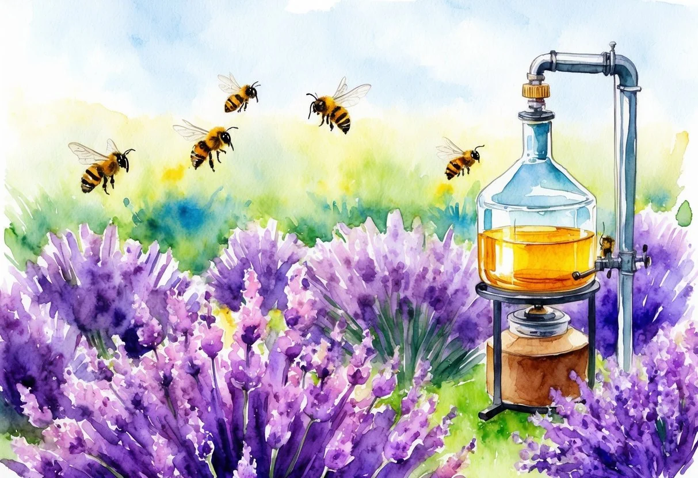
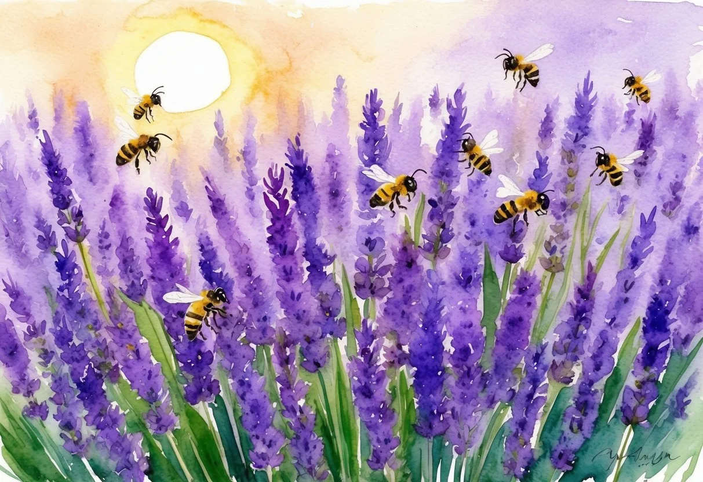

+++
title = "Les bienfaits et l'utilisation de l'huile essentielle de lavande: Guide pratique et avantages clés"
description = "Découvrez les bienfaits de l'huile essentielle de lavande ! Conseils pour la relaxation, les soins de la peau et le bien-être au quotidien."
date = 2025-02-12
draft = false
[taxonomies]
tags = ["HuileEssentielle", "Lavande", "Aromathérapie", "BienÊtre", "Relaxation", "SantéNaturelle", "Phytothérapie", "SoinsNaturels", "Sommeil", "Stress"]
+++

Connu pour son arôme apaisant, l'essence de lavande a traversé les âges, se taillant une place mythique dans la médecine naturelle. Utilisée depuis des siècles dans différentes cultures, cette huile essentielle est acclamée pour ses propriétés relaxantes qui œuvrent à calmer le système nerveux et favoriser un sommeil réparateur. **L'huile essentielle de lavande est reconnue pour ses bienfaits sur la santé, notamment grâce à ses propriétés antiseptiques et anti-inflammatoires.**

En aromathérapie, ces petites gouttes odorantes sont de véritables alliées pour soulager le stress et l'anxiété sans les effets secondaires des médicaments. Elles possèdent aussi des atouts cosmétiques et dermatologiques, rendant la peau plus saine et équilibrée. Intégrer l'huile essentielle de lavande dans son quotidien peut se faire de diverses manières, des diffuseurs aux baumes apaisants.

De plus, il est crucial de choisir et de conserver l'huile essentielle de lavande avec soin pour maximiser ses effets. S'assurer de la qualité et du mode de conservation vous aidera à bénéficier au mieux de ses vertus thérapeutiques. Que ce soit pour le bien-être mental, physique ou esthétique, les applications de cette huile en font une incontournable de la phytothérapie moderne.

### Principaux Points à Retenir

* L'huile essentielle de lavande est bénéfique pour la santé mentale et physique.
* Intégration facile dans les routines quotidiennes pour soulager le stress.
* Choix et conservation essentiels pour maximiser l'efficacité.

## Historique et origine de la lavande

La lavande a une riche histoire qui remonte à l'Antiquité. Utilisée pour ses propriétés parfumantes et médicinales, elle a évolué vers différentes déclinaisons au fil des siècles.

### Lavandula angustifolia et ses variantes

**Lavandula angustifolia**, souvent appelée lavande vraie ou lavande officinale, est originaire de l'ouest du bassin méditerranéen. Elle était prisée par les Romains pour parfumer les bains. En Provence, elle a été utilisée dès le Moyen Âge pour concevoir des parfums et des médicaments. Sa culture s'est intensifiée au XIXe siècle, transformant la région en cœur de la production de lavande.

Parmi les variantes, le **lavandin** est un hybride de lavande vraie et de **lavande aspic**. Il est largement cultivé en raison de son rendement élevé en huile essentielle. Ces différentes variétés de lavande continuent d'être prisées pour leurs applications aromatiques et thérapeutiques aujourd'hui. Utilisées dans les huiles essentielles, ces plantes continuent de jouer un rôle clé dans la culture et la médecine alternative.

## Les propriétés principales de l'huile essentielle de lavande

L'huile essentielle de lavande possède de nombreuses propriétés bénéfiques, notamment pour le système nerveux et la peau, tout en favorisant un sommeil réparateur. Ses vertus apaisantes et ses capacités thérapeutiques en font un allié précieux dans divers domaines de la santé.

### Effets sur le système nerveux et le stress

L'huile essentielle de lavande est reconnue pour ses propriétés calmantes et relaxantes. Elle agit efficacement sur le système nerveux, aidant à réduire le stress et l'anxiété. Sa composante naturelle permet de diminuer l'hyperactivité nerveuse, favorisant ainsi un état de calme. Des études montrent qu'inhaler cette huile peut induire une réduction notable du stress psychique et physique. Avec des effets anti-inflammatoires à la clé, elle participe également à la gestion des douleurs liées au stress. En tant qu'alternative naturelle aux médicaments, elle ne présente pas d'effets secondaires indésirables, constituant ainsi une solution sûre pour apaiser le mental et le corps.

### Vertus pour le soin de la peau

L'utilisation de l'huile essentielle de lavande en application cutanée offre de nombreuses vertus pour le soin de la peau. Grâce à ses propriétés antiseptiques et antibactériennes, elle aide à nettoyer et assainir les plaies. En outre, son action anti-inflammatoire soulage les irritations, les rougeurs et autres affections dermatologiques courantes. Appliquée localement, elle favorise la régénération cellulaire, réparant ainsi les tissus endommagés. Cet élixir naturel est également utilisé pour atténuer les cicatrices et apaiser les piqûres d'insectes. Pour les soins de beauté, sa capacité à équilibrer la production de sébum en fait un produit apprécié pour les peaux grasses.

### Avantages pour le sommeil et la détente

L'huile essentielle de lavande est particulièrement bénéfique pour améliorer le sommeil et induire la détente. Elle aide à instaurer une atmosphère sereine propice au repos, permettant de prévenir les insomnies et les troubles du sommeil. En diffusion, ses effluves apaisants créent un environnement paisible qui favorise un endormissement rapide. Les propriétés calmantes de l'huile, conjuguées à sa capacité d'atténuer l'anxiété, contribuent à un sommeil de meilleure qualité. Pour renforcer la détente, quelques gouttes ajoutées à un bain chaud ou appliquées sur les tempes peuvent libérer les tensions et préparer le corps au repos nocturne.

## Utilisations pratiques de l'huile essentielle de lavande

L'huile essentielle de lavande offre de nombreuses applications, notamment en tant que solution thérapeutique pour améliorer le sommeil et soulager la douleur. Elle est également prisée en aromathérapie pour ses effets apaisants et peut être appliquée directement sur la peau pour traiter des affections comme les brûlures et l'eczéma.

### Applications thérapeutiques

L'huile essentielle de lavande est reconnue pour ses propriétés thérapeutiques variées. Elle est particulièrement efficace pour favoriser un sommeil réparateur grâce à ses effets sédatifs naturels. Les personnes souffrant d'insomnie peuvent bénéficier de l'inhalation de son arôme avant le coucher.

Pour la gestion de la douleur, la lavande agit comme un anti-inflammatoire naturel. Elle est souvent utilisée pour soulager les maux de tête et les douleurs musculaires. Quelques gouttes appliquées sur les tempes ou mélangées à une huile de support pour un massage doux peuvent apporter un soulagement rapide.

### Aromathérapie et diffusion

En aromathérapie, la lavande est couramment utilisée pour ses propriétés relaxantes. Diffuser de l'huile essentielle de lavande dans une pièce aide à réduire le stress et l'anxiété, offrant un environnement paisible.

Les diffuseurs ultrasoniques sont souvent utilisés pour libérer les molécules de l'huile dans l'air. Cette méthode permet une distribution homogène du parfum, créant ainsi une atmosphère propice à la détente et au bien-être. Pour renforcer l'effet apaisant, il peut être combiné avec d'autres huiles essentielles comme la camomille.

### Application cutanée et massage

L'application cutanée de l'huile essentielle de lavande est préconisée pour traiter des affections dermatologiques. Elle possède des propriétés antiseptiques et cicatrisantes qui la rendent utile contre les brûlures mineures et l'eczéma.

En massage, elle détend les muscles et réduit les spasmes. Mélangée à une huile végétale comme l'huile d'amande douce, la lavande peut être appliquée localement pour soulager les crampes abdominales et favoriser la relaxation musculaire. Son parfum agréable enrichit aussi l'expérience sensorielle du massage.

## Recommandations et mise en garde

L'huile essentielle de lavande offre divers bienfaits, mais son utilisation requiert quelques précautions pour garantir la sécurité et l'efficacité. Les tests de tolérance cutanée sont essentiels pour éviter les réactions allergiques, tandis que certaines précautions doivent être prises par les personnes avec des conditions spécifiques.

### Test de tolérance cutanée et allergènes

Avant d'utiliser l'huile essentielle de lavande, réaliser un **test de tolérance cutanée** est primordial. Cela permet de prévenir d'éventuelles réactions allergiques. Pour ce faire, diluez une goutte de l'huile dans une cuillère à café d'une huile porteuse. Appliquez le mélange sur une petite zone de la peau, comme l'intérieur du coude. Attendez 24 heures pour observer toute réaction cutanée.

Les réactions peuvent inclure rougeurs, démangeaisons ou irritation. Il est aussi recommandé de consulter un professionnel de santé, surtout en cas d'antécédents d'allergies. L'huile de lavande est souvent utilisée pour améliorer la **qualité du sommeil** et pour ses propriétés calmantes sur le **système nerveux**, ce qui en fait un **remède naturel** prisé. Toutefois, toujours s'assurer de sa tolérance personnelle avant son utilisation.

### Contre-indications et précautions

Certaines **contre-indications** s'appliquent à l'huile essentielle de lavande. Les femmes enceintes et les jeunes enfants doivent éviter son usage sauf avis médical. L'huile doit toujours être **diluée** avant application cutanée.

Les personnes souffrant d'épilepsie ou de maladies cardiaques doivent être prudentes. Bien que la lavande soit réputée pour son effet apaisant sur le système nerveux, son interaction avec certains médicaments nécessite une vigilance accrue. Pour une utilisation sans risque, suivez rigoureusement les indications d'un professionnel de santé.

En respectant ces recommandations, l'utilisateur peut profiter des avantages de la lavande tout en minimisant les risques potentiels.

## L’huile essentielle de lavande dans la phytothérapie moderne

L'huile essentielle de lavande est utilisée couramment en phytothérapie pour ses nombreux effets bénéfiques. Connue pour ses propriétés anti-inflammatoires et antibactériennes, elle est également appréciée pour son effet relaxant.

### Études scientifiques et efficacité

Des recherches récentes confirment la réputation de l'huile essentielle de lavande en phytothérapie. Elle possède des **propriétés anti-inflammatoires**, réduisant efficacement l'inflammation dans divers contextes. Une étude indique que ses composés aident à apaiser les irritations cutanées et les douleurs articulaires.

Les **propriétés antiseptiques** et **antibactériennes** de la lavande en font un choix populaire pour traiter les infections mineures. En outre, son **effet relaxant** est reconnu pour atténuer le stress et l'anxiété, favorisant ainsi une relaxation profonde et naturelle. Des essais cliniques soulignent sa capacité à améliorer la qualité du sommeil, renforçant ainsi son rôle en phytothérapie moderne.

## Choisir et conserver l'huile essentielle de lavande

Pour maximiser les effets bénéfiques de l'huile essentielle de lavande, notamment la lavande vraie, il est essentiel de choisir un produit de qualité et de le conserver correctement. Voici les aspects clés à considérer pour faire un choix éclairé et pour optimiser sa durée de vie.

### Critères de qualité et labels

Lors de l'achat d'huile essentielle de lavande vraie, il est crucial de se concentrer sur la **pureté** et la **naturalité** du produit. Opter pour une huile 100% pure et sans additifs garantit l'intégrité de ses composés actifs. Vérifier les labels tels que *H.E.B.B.D.* (Huile Essentielle Botaniquement et Biochimiquement Définie) est également recommandé, car ils assurent l'origine botanique et la qualité biochimique de l'huile.

La provenance influence la qualité du produit final. Les huiles provenant de climats méditerranéens, où la lavande vraie est principalement cultivée, tendent à posséder une composition chimique optimale pour favoriser la qualité du sommeil et le bien-être général. L'étiquette doit également mentionner le nom scientifique, comme *Lavandula angustifolia* pour la lavande vraie, que vous pouvez apprendre plus à propos en explorant [cette source détaillée](https://www.huiles-et-sens.com/fr/guide-huiles-essentielles/34_quelle-huile-essentielle-de-lavande-choisir.html). Si vous le souhaitez, vous pouvez [obtenir des produits à base de lavande de haute qualité ici](https://doterra.me/IsN6WH).

### Conservation et durée de vie

Conserver correctement l'huile essentielle de lavande est vital pour préserver ses propriétés thérapeutiques. Elle doit être stockée dans des flacons en verre ambré ou bleu foncé, à l'abri de la lumière directe et de la chaleur, afin de protéger ses composés actifs sensibles. Un endroit frais et sec comme un placard est idéal pour éviter l'oxydation.

La durée de vie typique d'une huile essentielle de lavande peut atteindre jusqu'à trois ans. Pour garantir cette longévité, le flacon doit être bien fermé après chaque utilisation. Prenez garde aux changements d'odeur qui peuvent indiquer une dégradation. Pour de plus amples conseils, visitez ce [guide utile](https://landema.com/guide/comment-utiliser-lhuile-essentielle-de-lavande).

## Intégration de l'huile essentielle de lavande dans la vie quotidienne

L'huile essentielle de lavande est connue pour ses bienfaits relaxants. Elle peut être utilisée de manière simple et efficace pour soulager le stress et favoriser la relaxation. Ajouter quelques gouttes dans un diffuseur crée une ambiance apaisante à la maison ou au travail.

Pour améliorer le sommeil, elle peut être appliquée sur l'oreiller ou en quelques gouttes sur les poignets avant le coucher. Cette méthode favorise un sommeil réparateur tout en diminuant l'anxiété nocturne.

**En soins de peau**, mélanger quelques gouttes avec une crème ou une huile neutre aide à apaiser et régénérer la peau. Idéal pour adoucir et calmer les irritations cutanées.

**Utilisation quotidienne :**

* **Diffusion** : 3 à 5 gouttes dans un diffuseur.
* **Application cutanée** : Mélanger avec une huile véhicule (ex. huile d'amande) avant d'appliquer.
* **Bain relaxant** : Ajouter 5 à 10 gouttes à l'eau du bain pour une expérience relaxante.

En intégrant ces pratiques dans le quotidien, l'huile essentielle de lavande devient un allié précieux pour le bien-être général. Les différentes méthodes d'utilisation assurent que ses bienfaits soient accessibles tout au long de la journée.
