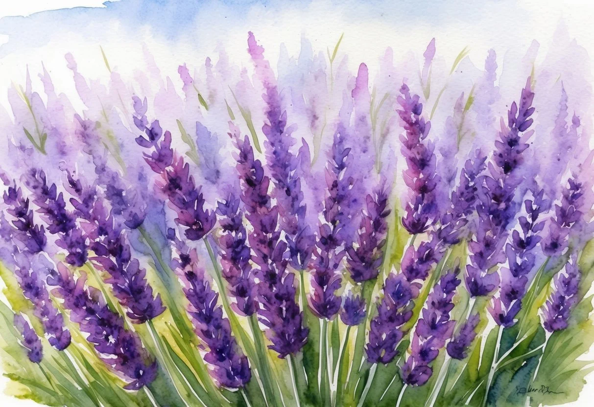
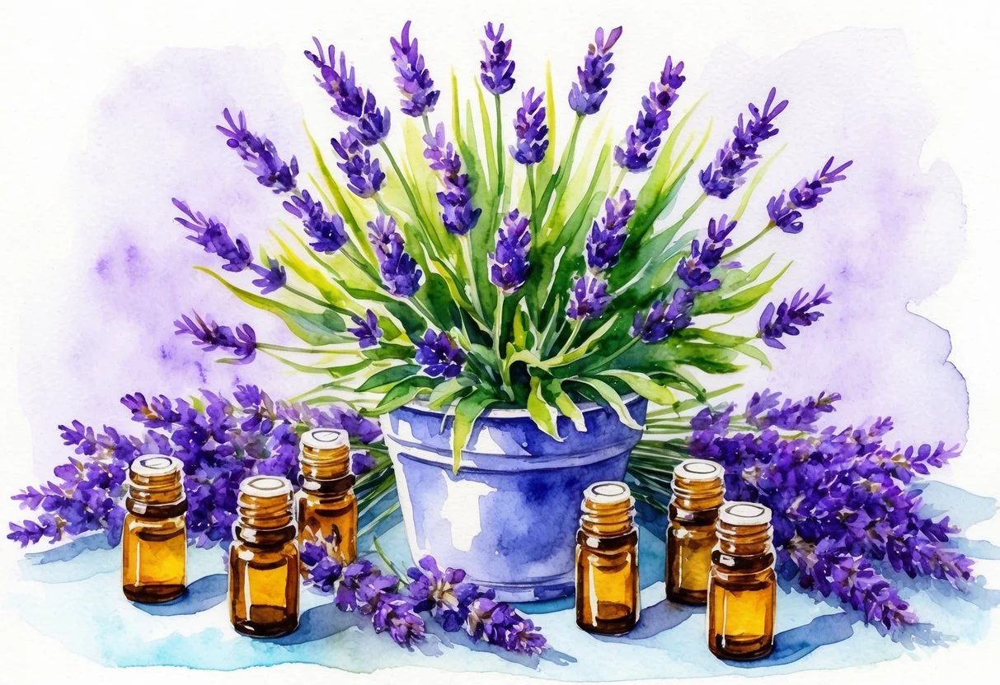

+++
title = "A levendula illóolaj kedvező hatásai és használata: Fedezze fel előnyeit és alkalmazási módjait"
description = "A levendula illóolaj nyugtató, stresszoldó és gyulladáscsökkentő hatásairól ismert. Fedezze fel, hogyan használható az aromaterápiában, bőrápolásban és egészségmegőrzésben! Cikkünk bemutatja a levendulaolaj előnyeit, előállítását és helyes alkalmazását."
date = 2025-02-12
draft = false
[taxonomies]
tags = ["levendula illóolaj", "levendula hatásai", "levendulaolaj használata", "aromaterápia", "bőrápolás", "stresszoldás", "természetes gyógymód", "gyulladáscsökkentő", "alvásjavító", "illóolaj előállítása"]
+++

A levendula illóolaj évszázadok óta ismert és elismert gyógyhatású szer, melyet számos kultúrában alkalmaznak. **A levendula illóolaj egyik legkiemelkedőbb tulajdonsága, hogy nyugtató és stresszoldó hatása van, amely segíti a relaxációt és az alvás minőségének javítását.** Ez a kis cseppnyi csodaanyag a modern orvostudományban is helyet kapott, köszönhetően széleskörű terápiás előnyeinek.

Amellett, hogy a levendula illóolaj elismert nyugtató hatású, immunerősítőként és antiszeptikumként is használják. Számos fájdalmat csillapítható és segíthet a gyulladások kezelésében, természetes alternatívát kínálva a hagyományos gyógyszerek helyett. Otthon is biztonsággal alkalmazható mindennapi problémákra, mint a fejfájás vagy kisebb bőrirritációk.

Nem szabad elfelejteni, hogy a levendula illóolaj használata megfelelő ismereteket igényel annak érdekében, hogy a használatból származó előnyök maximálisan kihasználhatók legyenek. A termék hatékonyságának biztosítása érdekében fontos a megfelelő hígítási arányok és az alkalmazási módok ismerete, minden esetben ügyelve a biztonsági intézkedésekre.

### A legfontosabb tanulságok

* Levendula illóolaj nyugtató és gyulladáscsökkentő hatású.
* Széles alkalmazási területe van a mindennapokban.
* Ismerni kell a megfelelő használat módját és elővigyázatosságot.

## A levendula növény bemutatása

A valódi levendula, tudományos nevén *Lavandula angustifolia*, egyike a világ legismertebb gyógynövényeinek. A levendula bokorszerű, illatos növény, amelyet évszázadok óta használnak gyógyászati és esztétikai célokra.

### Botanikai jellemzők

A *Lavandula angustifolia* egy örökzöld évelő növény, amely akár egy méter magasra is megnőhet. Finoman illatos levelei szürkészöld színűek, és általában hosszúkásak. Virágzatai füzérek formájában jelennek meg a szár tetején, amelyek kékes-lila színűek, azonban fehér vagy rózsaszín árnyalatok is előfordulhatnak.

A növény szárazságtűrő képessége révén jól alkalmazkodik a mediterrán éghajlathoz, és inkább a napos, szélvédett helyeket kedveli. Lazán szövetes vagy homokos talajban fejlődik a legjobban. A valódi levendulát gyakran termesztik kertekben is, úgy mint páros növény vagy sövény.

### Történeti áttekintés és elterjedés

A levendula már az ókorban nagy népszerűségnek örvendett, különösen az egyiptomiak körében, akik illatszerek készítéséhez használták. Később a rómaiak is alkalmazták fürdőkultúrájukban, ami hozzájárult a növény széleskörű elterjedéséhez Európában.

A középkorban a kolostorkertek gyakori növénye volt, ahol gyógyászati célokra használták. Ma már világszerte ismert, különösen Dél-Franciaországban és Spanyolországban található nagyobb termesztőterületeken. Az országok közötti kereskedelem révén eljutott Észak-Amerikába és Kelet-Európába is.

## Levendula illóolaj előállítása és jellemzői

A levendula illóolaj előállítása magában foglalja a virágokból történő kinyerést, amely komplex folyamatokkal történik. Jellemzői közé tartozik a sajátos illat, valamint az egyedülálló kémiai összetétel, amely számos pozitív hatással bír.

### Illóolaj kinyerési módszerei

A levendulaolaj kinyerése történhet gőzdesztillációval, amely a legelterjedtebb módszer. Ennek során a levendulavirágokat vízgőzben párolják, majd az olajat lehűtik és különítik el. Alternatív megoldásként az oldószeres extrakció is használható bizonyos helyzetekben, bár ez kevésbé gyakori.

A lepárlás mellett az oldószeres extrakció során oldószereket adnak a növényi anyaghoz. Az oldószer a virágok illatanyagait feloldja, és végül lepárolják, amíg az olaj meg nem marad. Ez a módszer segíthet a nehezen kinyerhető olajok előállításában, bár az oldószer teljes eltávolítása garantálható kell legyen az illóolajban.

### Fizikai és kémiai tulajdonságok

A levendula illóolaj jellegzetes ízű és illatú, amelyet a kémiai összetevők biztosítanak. **Színe halovány sárga**, **állaga folyékony** és **megfelelő sűrűségű**. **alacsony forráspontú**, amely megkönnyíti a lepárlási folyamatot.

Kémiailag a levendulaolaj fő összetevői észterek és alkoholok, amelyek különböző aromás tulajdonságokkal bírnak. Ezek a kémiai kompozíciók olyan előnyös hatást biztosítanak, hogy képesek egyszerre nyugtatni és fertőtleníteni, így kedvező ápoló és terápiás alkalmazásra.

### Főbb alkotóelemek

A levendula illóolaj két fő alkotóeleme **a linalil-acetát** és **a linalool**. Ezeken kívül tartalmaz még kisebb mennyiségben kumarint, cineolt és kámfort. Ezek az összetevők együttesen felelnek a levendulaolaj görcsoldó, nyugtató és fertőtlenítő hatásaiért.

A linalool a levendula illóolajban bőrápoló hatása miatt kiemelkedő, míg a linalil-acetát hozzájárul az olaj nyugtató hatásához. Ezek mellett a kumarin és cineol ad intenzitást az illatnak. A különféle összetevők megfelelő aránya meghatározó az olaj minőségében és hatékonyságában.

## Hatóanyagok és terápiás hatások

A levendula illóolaj sokféle hatóanyagot tartalmaz, beleértve a linaloolt és a linalil-acetátot, melyek fontos szerepet játszanak nyugtató, stresszoldó, valamint gyulladáscsökkentő és antibakteriális hatások előidézésében. Felhasználói különösen értékelik a fájdalomcsillapító és görcsoldó tulajdonságait.

### Nyugtató és stresszoldó tulajdonságok

A levendula olaj híres **nyugtató** hatásáról, amelyet főként a benne található észterek csoportjának köszönhet. Ezek az összetevők segíthetnek csökkenteni a **stressz** és szorongás tüneteit, javítva az általános közérzetet. Az olaj aromaterápiás használata elterjedt, mivel belégzése kedvezően befolyásolja az érzelmi állapotot, és hozzájárulhat a jobb alváshoz is.

Egy kutatás szerint a levendula illóolajnak szerepe lehet az alvászavarok enyhítésében, ami különösen hasznos lehet azok számára, akik alvási nehézségekkel küzdenek. Az este elvégzett relaxációs technikák, például a levendulaolajos masszázs, jelentősen hozzájárulhatnak a test és a lélek megnyugtatásához.

### Fájdalomcsillapító és görcsoldó hatások

A levendulaolaj széles körben alkalmazott **fájdalomcsillapító** és **görcsoldó** tulajdonságai miatt. Alkalmazása segíthet enyhíteni a fejfájás, migrén vagy akár izomfájdalmak tüneteit. Ezeknek a problémáknak a kezelésére gyakran keverik más hordozóolajjal, majd lokálisan alkalmazzák a fájó területen.

Az olaj masszázsba való integrálása szintén hasznos lehet az izomfeszültségek és görcsök oldásában. A sportolók is szívesen használják regenerálódás céljából, mivel elősegíti az izomlazítást és a gyógyulást. Mindazonáltal fontos, hogy használat előtt bőrpróbát végezzenek, elkerülve a potenciális irritációt.

### Gyulladáscsökkentő és antibakteriális hatások

A levendula illóolaj **gyulladáscsökkentő** és **antibakteriális** tulajdonságai miatt is népszerű. Ezek a hatások különösen előnyösek a kisebb bőrproblémák kezelésében, mint például a pattanások, kisebb sebek vagy horzsolások. Az olaj hasznos lehet a bőr fertőzésének megelőzésében és tisztításában.

Ezek a hatások orvosilag alátámasztottak, és kutatások is bizonyítják, hogy a levendula hatékony lehet a baktériumok és gombák elpusztításában. Alkalmazása így javasolt olyan bőrfelületeken is, ahol bőrirritáció vagy gyulladás alakult ki, így hozzájárulva a gyorsabb gyógyuláshoz.

## Alkalmazási területek

A levendula illóolaj sokoldalú felhasználást kínál a bőrápolásban, az aromaterápiában és gyógyászati alkalmazásokban. Az alábbiakban részletezzük, miként segíthet ez az illóolaj különböző területeken, kihasználva annak antibakteriális és nyugtató tulajdonságait.

### Bőrápolás és kozmetikumok

A levendulaolaj gyakran használt összetevő a kozmetikai iparban. Antibakteriális tulajdonságainak köszönhetően segíthet a pattanások kezelésében és a bőr tisztántartásában. **Regeneráló hatása** miatt a kis sebek és horzsolások gyógyulását is támogathatja.

Az olaj hidratáló hatású, így a száraz bőr ápolásában is hasznos lehet. Gyakran találkozhatunk vele arckrémekben és testápolókban, mivel kellemes illata és jótékony hatása miatt kedvelt választás. Az érzékeny bőrűeknek is ajánlott, mivel ritkán okoz irritációt.

### Aromaterápia és párologtatás

A levendula illóolaj aromaterápiában való alkalmazása a relaxáció elősegítésére terjedt el. Amellett, hogy segít ellazulni és csökkenteni a stresszt, az olaj párologtatása javítja a légzést és segítheti az alvás minőségét. Sokak szerint az aromaterápiás fürdők vagy diffúzorokban használt levendulaolaj **nyugtató légkört** teremt.

A fitnesz és jóga közösségek is szívesen használják, mivel harmonizáló hatása segíti az összpontosítást és a meditációt. **Hatékony lehet** munkahelyi stressz kezelésére is, ha időnként párologtatják a levegőbe.

### Gyógyászati felhasználások

Gyógyászati szempontból a levendulaolaj fertőtlenítő tulajdonságai révén hasznos lehet. A levendula segíthet enyhíteni a kisebb bőrproblémákat, mint például **gombás fertőzések**. Belsőleg alkalmazva, például nyelv alá csepegtetve, javíthatja az emésztést.

**Fájdalomcsillapító hatása** miatt enyhítheti fejfájást, migrént vagy izomgörcsöket, különösen masszázsolajként alkalmazva. Különböző tanulmányok vizsgálják a levendulaolaj lehetséges további egészségügyi előnyeit, bár mindig érdemes szakértői tanácsot kérni használata előtt.

## Levendula illóolaj mindennapos használata

A levendula illóolaj számos otthoni és személyi alkalmazásban hasznos, és különféle kiegészítőkkel kombinálva kiemelkedő használati lehetőségeket kínál.

### Otthoni alkalmazások

A levendula illóolaj otthoni környezetben sokoldalúan használható. Hígított formában a bőrápolás részeként alkalmazható, például kézkrémekhez adva, elősegítve a bőr hidratálását és friss illatot kölcsönözve. Az illóolaj gyakran kerül bele otthon készített fürdősókba, amelyekhez tej és méz adható, hogy a bőr táplált és puha legyen. Citromfű levél hozzáadásával összhangban erőteljes nyugtató hatást érhetnek el, ami elősegíti a relaxációt fürdés közben.

Levegőillatosítás esetén ezzel a friss illattal fűszerezett párologtatókban hatékonyan használható a stresszoldás érdekében. Az otthoni tisztítószerekhez is keverhető, így természetes antibakteriális hatással bír. Ha szeretne, [itt kiváló minőségű levendula termékeket szerezhet be](https://doterra.me/BRAT2l).

### Kiegészítők és termékkörök

A levendula illóolaj sokféle kiegészítővel és termékkel kombinálható a mindennapos használat érdekében. Mivel különféle testápolási termékek része lehet, például testpermetek vagy illatgyertyák, a felhasználási lehetőségek széleskörűek. Az ilyen kiegészítők segítenek az ellazulásban és a stressz csökkentésében.

A levendula illóolaj zárható üvegcsékben való tárolása lehetővé teszi, hogy hosszabb ideig friss maradjon. Emellett kombinálható más természetes összetevőkkel, mint például [citromfűvel](https://megoldasmaskepp.hu/2021/04/21/a-levendulaolaj-kedvezo-hatasa-a-szervezetre), hogy fokozza a nyugtató hatást. Házi készítésű kenőcsökben vagy balzsamokban való felhasználása szintén kedvelt, mivel elősegíti a helyi felhasználást, és természetes alternatívát kínál a vegyi anyagokat tartalmazó termékek helyett.

## Kockázatok és biztonsági intézkedések

A levendula illóolaj alkalmazása során felmerülhetnek bizonyos kockázatok. Érdemes ismerni az esetleges mellékhatásokat és óvintézkedéseket, valamint az esetleges ellenjavallatokat és interakciókat más anyagokkal.

### Lehetséges mellékhatások és óvintézkedések

A levendula illóolaj használata során néhány embernél előfordulhatnak mellékhatások, például bőrkiütés vagy **allergiás reakció**. Amennyiben valaki allergiás a levendulára, kerülni kell az olaj alkalmazását, különösen a bőrön való felhasználást.

*A bőrérzékenységi teszt* segíthet minimalizálni az allergiák kockázatát. Kisebb mennyiségű olajat vigyen fel egy kis bőrfelületre, és figyelje meg a reakciót 24 órán keresztül. Kerülni kell a szembe és a nyálkahártyára való közvetlen alkalmazást.

*Terhesség* és *szoptatás* alatt a levendula illóolaj használatát javasolt gondosan mérlegelni. Előzetes orvosi konzultáció nélkül nem ajánlott a használatuk ebben az időszakban, mivel a növényi hatóanyagok befolyásolhatják a hormonális egyensúlyt.

### Ellenjavallatok és interakciók

Bizonyos csoportok számára ellenjavallt a levendula illóolaj használata. Azok, akik *antidepresszánsokat* vagy más központi idegrendszeri gyógyszereket szednek, óvatosak legyenek, mivel a levendula fokozhatja ezek hatását, egyes esetekben szedációt okozva.

Anyagokkal való *interakciók* esetén az illóolaj más gyógynövényekkel vagy illóolajokkal is okozhat nem kívánt hatásokat, különösen, ha azok hasonló módon hatnak az idegrendszerre. Ezért fontos, hogy kombinált használat esetén alaposan utánajárjunk az összetevők kölcsönhatásainak.

A levendula illóolaj használatát mindig alacsony dózisban érdemes kezdeni, figyelve a szervezet reakcióit az olajra.
