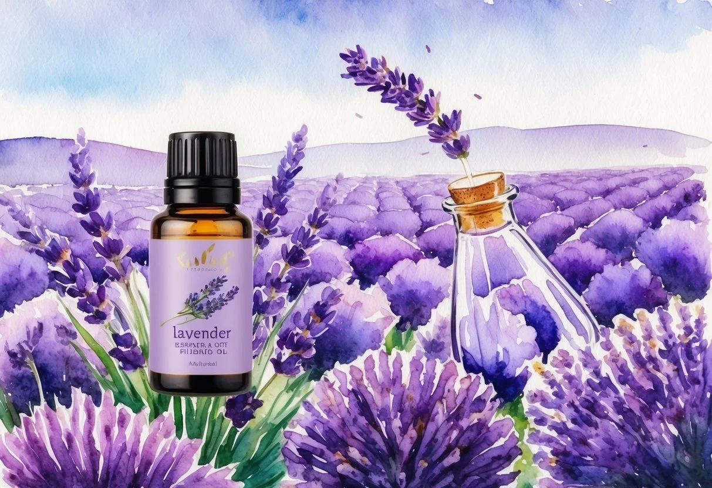
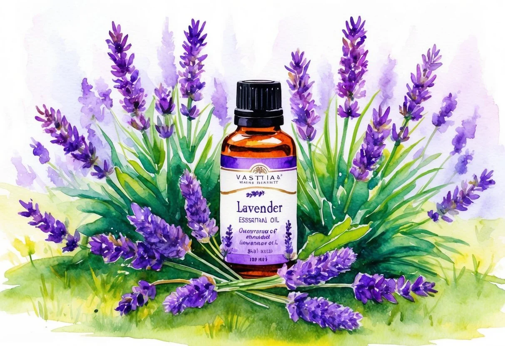

+++
title = "Benefits and Usage of Lavender Essential Oil: A Comprehensive Guide"
description = "Discover the incredible benefits and versatile uses of lavender essential oil in this comprehensive guide. From promoting relaxation and improving sleep quality to enhancing skin and hair health, lavender oil is a must-have for natural wellness. Learn about its historical significance, therapeutic properties, and safe application methods to unlock its full potential in aromatherapy, skincare, and household cleaning."
date = 2025-02-12
draft = false
[taxonomies]
tags = ["Lavender essential oil", "Benefits of lavender oil", "Lavender oil for sleep", "Aromatherapy with lavender", "Natural remedies", "Essential oils for skin", "Lavender oil for hair growth", "Uses of lavender essential oil", "Organic skincare", "Holistic healing"]
+++

Lavender essential oil has long been cherished for its soothing properties and versatility, making it a staple in many homes. From its sweet-smelling aroma to its numerous therapeutic applications, lavender oil is celebrated for its ability to calm both the mind and body. **Its ability to relieve anxiety and improve sleep quality makes lavender essential oil a popular choice in aromatherapy.**

Beyond its relaxing fragrance, lavender oil boasts impressive benefits for skin and hair. It can help address skin irritations, reduce blemishes, and promote hair health, adding to its multifaceted appeal. Many people incorporate lavender essential oil into their beauty and wellness routines to enhance skin texture and boost hair vitality through natural means.

In addition to personal care, lavender essential oil is widely used in household applications, such as freshening up living spaces and repelling insects. The oil’s natural properties make it an effective cleaning solution, offering a chemical-free alternative for home maintenance. Whether for personal or household use, lavender oil proves to be an invaluable resource in everyday life.

### Key Takeaways

* Lavender essential oil soothes anxiety and promotes better sleep.
* It benefits skin and hair health, offering natural care solutions.
* The essential oil is versatile for both personal and household use.

## Historical Background of Lavender

Lavender, famous for its pleasing fragrance and versatility, has a rich history that stretches across various cultures. From its origins in the Mediterranean region to its widespread cultivation today, lavender, particularly *Lavandula angustifolia*, has been valued for both medicinal and aromatic uses.

### Origin and Cultivation

Lavender originated in the Mediterranean, Middle East, and parts of India. It thrives in dry, rocky terrain and sunny climates, making it well-suited to regions like the Canary Islands and parts of Europe. The plant's adaptability has led to its widespread cultivation across the world, including in Africa and Asia. Its botanical name, *Lavandula angustifolia*, points to its narrow leaves, a distinctive feature of this species.

The cultivation of lavender expanded significantly with the rise of essential oils. Its aromatic qualities and potential health benefits have made it a staple in gardens and farms. The lavender plant demands well-drained soil and benefits from regular pruning to enhance growth. Today, lavender is grown commercially in places like France, where it supports a thriving essential oil industry.

### Extraction Methods

Lavender essential oil is primarily extracted using steam distillation. This method preserves the oil's purity and therapeutic properties. During the process, steam passes through the lavender flowers, capturing the volatile oils. The steam-oil mixture is then condensed into a liquid, separating the oil from water.

Historically, lavender oil was used for its antiseptic and healing properties. Greek and Roman soldiers reportedly utilised it for treating wounds, showcasing its long-standing medicinal use. With a rising interest in natural health remedies, lavender essential oils have become even more popular, continuing a tradition that dates back centuries.

## Properties of Lavender Essential Oil

Lavender essential oil is celebrated for its diverse properties, which include a rich chemical composition, antioxidant and anti-inflammatory effects, and antimicrobial capabilities. These attributes contribute to its extensive use in aromatherapy, cosmetics, and traditional medicine.

### Chemical Composition

Lavender essential oil is derived from the flowers of the lavender plant, primarily through steam distillation. Its primary constituents include linalool and linalyl acetate. **Linalool** is a type of terpene alcohol known for its soothing and calming qualities, while **linalyl acetate** is an ester that enhances relaxation and adds a sweet floral note.

Other compounds found in lavender oil include camphor, beta-caryophyllene, and terpinen-4-ol. Each component plays a role in the oil’s distinctive aroma and therapeutic benefits.

The balanced mix of these elements provides the oil with a range of applications. As a versatile essential oil, it is widely used in perfumes, cleaning products, and home remedies. Understanding the intricate makeup of lavender essential oil allows for informed usage in various contexts.

### Antioxidant and Anti-inflammatory

Lavender essential oil demonstrates substantial antioxidant and anti-inflammatory properties. Antioxidants help neutralise free radicals, which are unstable molecules linked to oxidative stress and cell damage. This attribute makes lavender oil valuable for skincare, offering protection and promoting healthy skin.

The anti-inflammatory effects of lavender oil are attributed to its ability to inhibit inflammatory responses. Studies suggest that linalool and linalyl acetate play key roles in reducing inflammation, providing relief from conditions such as muscle soreness and joint pain.

Used in massage therapy, lavender oil assists in easing tension and soothing irritated skin. This makes it a favourite choice for holistic therapies aimed at promoting relaxation and reducing discomfort.

### Antimicrobial and Antiseptic

Lavender essential oil is recognised for its potent antimicrobial and antiseptic qualities. It is effective against a broad spectrum of bacteria, fungi, and viruses. These properties make it a popular choice for disinfecting cuts, scrapes, and minor burns, reducing the risk of infection.

**Antibacterial properties** are largely due to linalool, which disrupts bacterial growth. Linalyl acetate complements this action, enhancing lavender oil’s efficacy as a natural cleaning agent.

In aromatherapy, it is often used to purify air and create a hygienic environment. Combining its antiseptic power with a pleasing aroma, lavender oil remains a staple in personal care and household products.

## Therapeutic Uses and Health Benefits

Lavender essential oil is renowned for its broad range of therapeutic uses and health benefits. It is particularly noted for its calming effects, which may aid sleep and support mental well-being. Additionally, it offers wound healing, skin care, and pain relief properties that are highly valued by users.

### Calming Effects and Sleep Aid

Lavender essential oil is widely used to improve sleep quality. Its calming scent is thought to aid relaxation, making it a popular choice for those experiencing insomnia. Many people find that incorporating lavender into their nighttime routine, such as using it in a diffuser or spraying it on pillows, can promote restful sleep. Research suggests its aroma has a soothing effect on the nervous system, potentially reducing stress and facilitating better sleep.

### Wound Healing and Skin Care

Lavender essential oil has properties beneficial for [wound healing](https://www.emedihealth.com/health-news/lavender-essential-oil-uses) and skin care. Known for its antimicrobial characteristics, it can help prevent infections and support the healing of minor cuts and burns. Many find it effective when diluted and applied topically to soothe irritated skin or acne. Its anti-inflammatory effects make it a valuable component in lotions and creams designed to reduce redness and promote skin health.

### Pain Relief and Anti-inflammatory

As a natural remedy, lavender essential oil is often used for pain relief and to reduce inflammation. Its anti-inflammatory properties may help alleviate aches and pains when applied as a massage oil, contributing to its use in treating muscle soreness and joint pain. It’s a common ingredient in aromatherapy treatments aimed at reducing tension headaches and migraines, providing a natural alternative to over-the-counter pain relievers.

### Mental Health and Emotional Well-being

Lavender essential oil is praised for supporting mental health and emotional well-being. It is thought to reduce symptoms of anxiety and depression, making it a useful adjunct in managing stress and mood disorders. The oil’s aromatic compounds may influence mood regulation by decreasing the production of stress hormones. Incorporating lavender into daily rituals like meditation or relaxation exercises can enhance its calming effects and promote a sense of emotional balance.

## Benefits for Skin and Hair

Lavender essential oil is renowned for its versatility in skin and hair care. Its ability to soothe irritation, promote hair growth, and support skin health makes it a valuable addition to beauty routines.

### Treatment for Skin Conditions

Lavender essential oil is effective in managing several skin conditions. Its antifungal properties are beneficial for treating common issues like acne and eczema, helping to reduce inflammation and redness. By balancing the skin's natural oils, it can prevent breakouts and soothe swollen areas.

When diluted with a carrier oil, lavender oil can be applied to specific problem areas to enhance healing. For eczema, the oil helps reduce itching and irritation, making it a favoured choice for natural skin care solutions. Its calming aroma also aids relaxation, further supporting skin health by reducing stress-related flare-ups.

### Hair Growth and Scalp Health

Lavender essential oil promotes hair growth and maintains scalp health. The oil's antimicrobial properties ensure a clean and healthy scalp environment, which is essential for reducing dandruff and itchiness. Regular massage with lavender oil can improve blood circulation to the hair follicles, encouraging stronger hair growth.

By mixing lavender oil into a conditioning treatment, individuals can nourish both the scalp and hair shafts, leading to improved texture and shine. It's an ideal remedy for those dealing with thinning hair or scalp irritation, offering a natural alternative for those seeking hair care solutions free from harsh chemicals.

### Anti-aging and Skin Health

Lavender essential oil is a valuable component in anti-aging skin care. Its antioxidants help to combat free radicals, which can contribute to premature ageing. This makes lavender oil a sought-after addition to beauty products aimed at reducing fine lines and maintaining skin elasticity.

When added to moisturisers or serums, lavender oil provides a soothing and conditioning effect that can help even out skin tone and reduce the appearance of wrinkles. Its ability to support cell regeneration further enhances its role in promoting a youthful complexion. Incorporating lavender oil into daily skincare routines can provide noticeable benefits over time.

## Aromatherapy and Household Uses

Lavender essential oil offers diverse applications within aromatherapy and household settings. Its calming properties make it an excellent choice for stress reduction, room fragrance, and even as a natural insect repellent and antifungal solution.

### Aromatherapy and Stress Reduction

Lavender essential oil is renowned for its ability to promote relaxation and reduce stress. It is often used in aromatherapy to calm the mind and body, providing a soothing effect. When inhaled, it interacts with the brain's limbic system, which controls emotions, and can help alleviate anxiety and tension.

Incorporating lavender oil into a daily routine can enhance mental well-being. A few drops in a warm bath or added to a massage oil can significantly improve mood and promote tranquillity. Its calming properties make it an ideal choice for those seeking peace in their daily lives.

### Diffusers and Room Fragrance

Lavender oil is a popular addition to diffusers, acting as a natural air freshener throughout homes. When diffused, its fragrance permeates rooms, offering both olfactory pleasure and calming properties. Diffusers are designed to disperse essential oils into the air, creating an inviting atmosphere.

Using lavender oil in this way can refresh stale air and provide a pleasant aroma. Diffusers are often used in bedrooms to promote restful sleep or in living areas to create a calming environment. The oil's natural fragrance helps maintain a serene ambiance and can reduce the need for synthetic air fresheners.

### Natural Insect Repellent and Antifungal

Lavender essential oil serves as an effective natural insect repellent and antifungal agent. Its scent is disliked by many insects, making it useful against mosquitoes and other pests. By applying a few drops to a candle or using it in a spray, one can protect living spaces from unwanted visitors.

Furthermore, its antifungal properties can help combat mild fungal infections. When diluted, it may be applied to the skin to address issues such as athlete's foot. This dual-purpose nature makes lavender oil a versatile tool in maintaining a healthy home environment.

## Culinary Applications and Other Uses

Lavender has found its place beyond the realm of aromatherapy, particularly in kitchens where it enhances both food and drink. It also plays a significant role in infused products that bring a unique flavour and fragrance.

### Lavender in Cooking and Beverages

Lavender lends a distinct floral note to various dishes and beverages, making it a popular ingredient in Mediterranean and European cuisine. Its ability to balance sweet and savoury flavours means lavender can be used to flavour baked goods, including cakes, biscuits, and scones.

Lavender tea is another popular option, known for its calming properties. Simple to prepare, lavender tea involves steeping dried lavender buds in hot water, resulting in a soothing drink that combines fragrance with relaxation.

Herbes de Provence, a classic herb blend, often incorporates lavender alongside thyme, rosemary, and oregano for use in roasting and grilling. This blend particularly complements meats and vegetables, imparting a subtle fragrant note. When used carefully, it can elevate a dish from ordinary to exceptional.

### Lavender Infused Products

In addition to its culinary uses, lavender is infused into a variety of products that appeal to those seeking natural alternatives. Lavender-infused honey offers a sweet hint of floral essence which is perfect for drizzling over fruit or adding to herbal teas like lavender tea.

Lavender-infused syrups are another popular product used in cocktails, lemonades, and other beverages for a unique twist. They provide an aromatic, sweet element ideal for refreshing summer drinks.

Lavender also serves in infusing oils used for cooking or salad dressings, imparting a delicate flavour to enhance rather than overpower dishes. These products demonstrate lavender's versatility beyond direct culinary application, broadening its use in both food and drink experiences.

You can [get high quality lavender products here](https://doterra.me/jSVZL-).

## Using Lavender Essential Oil Safely

When using lavender essential oil, it's crucial to consider the correct dosage and application methods, be aware of any potential side effects or allergic reactions, and know the necessary precautions for sensitive groups.

### Dosage and Application

Lavender essential oil can be used in various ways, such as aromatherapy, topical application, and in some cases, internal consumption. It's vital to dilute lavender oil with a **carrier oil** like coconut or jojoba oil when applying it to the skin. This helps reduce the risk of irritation.

A common dilution ratio is 2-3 drops of lavender oil per teaspoon of carrier oil. For aromatherapy, a diffuser can be used to distribute the fragrance through the air. Lavender oil can be added to bathwater for relaxation, ensuring it’s mixed with a carrier oil or bath salts to disperse evenly.

### Potential Side Effects and Allergic Reactions

Lavender essential oil is generally safe, but individuals may experience side effects such as skin irritation or **allergic reactions**. Before using it topically, it is advisable to conduct a **patch test** on a small area of the skin to check for any adverse reaction.

Patch tests involve applying a diluted mixture of lavender oil to a discreet area of skin and waiting 24 hours to see if any irritation occurs. Symptoms of an allergic reaction include redness, itching, or a rash. If discomfort occurs, discontinue use immediately.

### Precautions for Sensitive Groups

Certain groups must exercise caution when using lavender oil. Pregnant or breastfeeding women should consult healthcare professionals before use. Children's skin is more sensitive, so lavender oil should always be highly diluted and used sparingly. For young children, it's advisable to seek guidance from a healthcare provider prior to use.

People with a history of allergies or sensitive skin conditions should also be cautious. Those suffering from conditions like asthma should use lavender oil under medical supervision, particularly if using a **topical application** or inhaling concentrated aromas.

## Conclusion

Lavender essential oil is a versatile tool in the realm of natural remedies. Its **therapeutic properties** have been recognised for centuries, making it a staple in both traditional and contemporary health practices.

Renowned for its calming effects, lavender oil aids in alleviating stress and promoting relaxation. These qualities have made it popular in aromatherapy, where its soothing scent is used to bring about mental peace.

Beyond mental well-being, lavender essential oil is also known for its skin benefits. Its antimicrobial properties make it a valuable addition to skincare routines, helping to maintain clear and healthy skin.

Lavender oil's ability to enhance sleep quality is particularly noteworthy. Individuals experiencing insomnia or mild sleep disturbances may benefit from its relaxing aroma, which has been shown to improve sleep patterns.

The oil can be used in various ways, including inhalation and topical application. Each method offers unique advantages, allowing users to tailor its use according to personal needs.

While its benefits are numerous, it is essential to ensure proper usage to maximise its effectiveness and minimise any potential side effects. Due diligence in understanding how to incorporate lavender oil into daily routines is vital for achieving optimal results.
