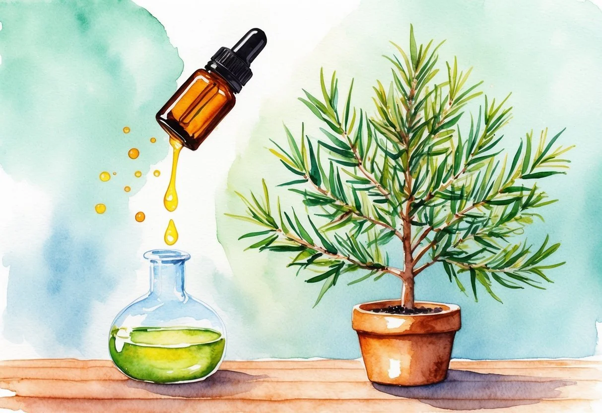

+++
title = "Les bienfaits et l'utilisation de l'huile essentielle d'arbre à thé: Guide complet pour votre santé"
description = "Découvrez les bienfaits de l'huile essentielle d'arbre à thé : antibactérienne, antifongique et purifiante, idéale pour la peau, les cheveux et l'immunité."
date = 2025-02-17
draft = false
[taxonomies]
tags = ["HuileEssentielle", "Aromathérapie", "BienÊtre", "SantéNaturelle", "Phytothérapie", "SoinsNaturels", "Antibactérien", "Antifongique", "Immunité", "Peau", "Cheveux", "Infections", "Acné", "Respiration"]
+++

L'[huile essentielle](https://jardinessentiel.fr/fr/tags/huileessentielle/) d'arbre à thé est largement reconnue pour ses nombreuses propriétés bénéfiques.

**Elle est particulièrement efficace pour combattre les infections bactériennes et virales, ce qui en fait un incontournable dans l'aromathérapie.**

En effet, cette huile peut être utilisée pour traiter une variété de problèmes allant de l'acné aux infections bucco-dentaires.

L'arbre à thé, ou Melaleuca alternifolia, provient d'Australie. L'huile essentielle est extraite par la distillation de ses feuilles.

Elle offre des effets désinfectants et peut renforcer les défenses immunitaires.

Les utilisations courantes incluent les [soins de la peau](https://jardinessentiel.fr/fr/tags/soinsnaturels/), la désinfection des petites plaies, et le soulagement des irritations.

L'huile essentielle de tea tree, extraite des feuilles de *Melaleuca alternifolia*, est renommée pour ses multiples vertus thérapeutiques. Composée de divers éléments actifs, elle possède des propriétés antiseptiques, antibactériennes, antifongiques, antivirales, et anti-inflammatoires.

### Composants Actifs

L'huile de tea tree contient plusieurs composés importants.

Les éléments principaux sont le terpinéol et les terpinènes, qui jouent un rôle crucial dans ses propriétés thérapeutiques.

Le [1,8-cinéole](https://www.santemagazine.fr/medecines-alternatives/approches-naturelles/huiles-essentielles/huile-essentielle-darbre-a-the-melaleuca-alternifolia-177093) est un autre composant, connu pour ses effets bénéfiques sur la santé.

Ces composés sont responsables de l'odeur caractéristique de l'huile et de ses capacités de guérison.

Ces éléments permettent à l'huile de tea tree d'être utilisée dans de nombreux produits pour la santé et la beauté.

### Propriétés Antiseptiques

Les propriétés antiseptiques de l'huile de tea tree sont puissantes et polyvalentes.

Elle est efficace pour nettoyer les petites coupures et éraflures.

Elle peut être utile pour désinfecter les surfaces grâce à sa capacité à éliminer les germes.

Cette huile est souvent utilisée dans les produits de nettoyage naturels.

Sa capacité à combattre diverses infections en fait un choix populaire parmi ceux qui privilégient les remèdes naturels.

### Propriétés Antibactériennes

L'huile essentielle de tea tree est reconnue pour ses propriétés antibactériennes remarquables.

Elle peut détruire des bactéries courantes tout en étant douce pour la peau.

Cela la rend précieuse pour traiter les infections mineures et l'acné.

Les produits de soins naturels incorporant cette huile en profitent pour lutter contre les bactéries responsables des imperfections.

Elle joue aussi un rôle dans le maintien de l'hygiène en tant qu'ingrédient dans les savons et lotions.

### Propriétés Antifongiques

Les propriétés antifongiques de l'huile de tea tree sont particulièrement appréciées dans le traitement des infections fongiques, comme le pied d'athlète.

Elle aide à freiner la croissance des champignons de manière efficace.

Son utilisation régulière peut contribuer à prévenir les récidives de ces infections.

En ajoutant quelques gouttes à l'eau du bain, elle peut également offrir une solution naturelle pour les problèmes de peau liés aux champignons.

### Propriétés Antivirales et Anti-inflammatoires

L'huile de tea tree possède aussi des propriétés antivirales et anti-inflammatoires notables.

Elle est souvent utilisée pour apaiser les irritations cutanées et réduire les rougeurs.

*Melaleuca alternifolia* peut aider à soulager les symptômes mineurs de maux divers tels que les rhumes.

En application locale, elle apaise les inflammations dues à diverses causes.

Sa capacité à combattre les virus en fait un précieux allié dans une approche de santé globale.

## Bienfaits et Vertus Médicinales

L'huile essentielle d'arbre à thé offre divers bienfaits pour la santé.

Elle est reconnue pour ses propriétés antiseptiques, antifongiques et anti-inflammatoires.

Elle agit sur la peau, les cheveux, et renforce le système immunitaire tout en soulageant les problèmes respiratoires et en étant utilisée en aromathérapie.

### Pour la Peau

L'huile d'arbre à thé est souvent utilisée pour traiter la **peau grasse** et **acnéique** grâce à ses propriétés antibactériennes.

Elle aide aussi dans la cicatrisation des *plaies* et soulage les démangeaisons de l'eczéma.

Ses vertus antifongiques la rendent efficace contre les **mycoses** et les infections à champignons.

Pour appliquer, on peut diluer quelques gouttes dans une huile porteuse et appliquer directement sur les zones affectées.

### Pour les Cheveux

Cette huile essentielle peut aider à traiter les **pellicules** et à assainir le **cuir chevelu**.

Son action antifongique cible les champignons responsables des pellicules et apaise les démangeaisons.

Pour éliminer les **poux**, une application régulière, combinée à un peigne fin, peut être efficace.

Mélanger quelques gouttes avec le shampooing habituel offre une solution pratique.

### Soutien du Système Immunitaire

En tant qu'**immunostimulant**, l'huile d'arbre à thé renforce les **défenses immunitaires** du corps.

Elle combat les infections, diminuant la gravité et la durée des maladies courantes.

L'incorporation de cette huile dans un diffuseur peut contribuer à maintenir un environnement sain, surtout pendant les saisons froides.

### Traitement des Problèmes Respiratoires

L'huile essentielle d'arbre à thé est efficace pour soulager les symptômes liés aux infections respiratoires.

Elle aide à décongestionner les **voies respiratoires** en cas de **rhume**, de **bronchite**, de **grippe**, ou de **sinusite**.

Inhaler l'huile, diluée dans de l'eau chaude, est une méthode simple pour favoriser une respiration plus aisée.

### Utilisation en Aromathérapie

En **aromathérapie**, l'huile d'arbre à thé est appréciée pour ses effets calmants et purifiants.

Elle assainit l'air tout en favorisant une ambiance apaisante.

On peut l'utiliser dans un diffuseur pendant les périodes de stress ou lorsqu'on se sent encensé par les émotions.

Son parfum aide à clarifier l'esprit et à encourager la relaxation.

## Utilisation et Application

L'huile essentielle d'arbre à thé est reconnue pour son efficacité dans de nombreuses applications.

Elle peut être utilisée de manière topique pour traiter les affections cutanées, par inhalation pour soulager les voies respiratoires, et dans les bains ou massages pour ses propriétés purifiantes et relaxantes.

### Usage Topique

L'application cutanée de l'huile essentielle d'arbre à thé offre des bienfaits cicatrisants et antibactériens.

Elle est souvent utilisée sur la peau pour lutter contre les coupures, les verrues, et les coups de soleil.

Pour éviter les irritations, il est conseillé de mélanger quelques gouttes d'huile essentielle avec une huile végétale, comme l'huile de coco ou d'amande douce.

Le pouvoir purifiant de l'arbre à thé aide également à apaiser des problèmes comme l'acné et l'eczéma.

Les pores sont nettoyés en profondeur, ce qui réduit les rougeurs et les inflammations.

### Inhalation et Diffusion

L'inhalation de l'huile essentielle d'arbre à thé est efficace pour les voies respiratoires. Quelques gouttes dans un bol d'eau chaude peuvent être inhalées pour soulager les maux de gorge et décongestionner les sinus.

Cette méthode renforce le système immunitaire et offre une bonne solution pour combattre les rhumes.

La diffusion dans l'air, avec un diffuseur approprié, purifie l'atmosphère d'une pièce. Cette pratique est utile pour éliminer les bactéries aérogènes et fournir un environnement plus sain, surtout pendant les mois d'hiver.

Elle offre aussi une action relaxante qui aide à diminuer le stress quotidien.

### Bain et Massage

Un bain aromatique mêlant l'huile essentielle d'arbre à thé est une excellente façon de profiter de ses propriétés purifiantes et relaxantes. Ajouter quelques gouttes à l'eau du bain peut aider à soulager les muscles tendus et à revitaliser le corps après une longue journée.

Pour les massages, mélanger l'huile de tea tree avec une huile de support est bénéfique pour calmer les irritations cutanées.

Ce remède est souvent choisi pour apaiser l'herpès et favoriser la récupération dermique. Le massage aide aussi à détendre le corps et l'esprit, grâce à son effet relaxant.

### Autres Utilisations Spécifiques

L'huile essentielle de tea tree trouve plusieurs autres usages spécifiques. Elle peut être appliquée directement sur les verrues pour aider à les réduire, et souvent sur les boutons de fièvre pour accélérer le processus de guérison.

Ses propriétés font de cette huile un allié dans le soin des infections fongiques comme le pied d'athlète.

En outre, son action purifiante sur l'air et les surfaces en fait un bon désinfectant naturel pour l’entretien de la maison.

En dilution, elle peut être utilisée pour nettoyer les surfaces, offrant ainsi une alternative saine et écologique aux produits chimiques ménagers.

Vous trouverez ici [des produits à base d'huile essentielle de l'arbre à thé fabriqués de manière éthique](https://doterra.me/Ppokwk).

## Précautions et Recommandations

Lors de l'utilisation de l'huile essentielle d'arbre à thé, il est crucial de prendre certaines précautions pour éviter les effets indésirables.

Ces mesures incluent la réalisation de tests cutanés, l'attention portée aux contre-indications, et la considération d’interactions potentielles avec d'autres substances.

### Test Cutané

Pour éviter les réactions allergiques, un **test cutané** est recommandé.

Appliquez une petite quantité d'huile diluée sur une zone de peau propre, comme l'intérieur du poignet. Attendez 24 heures pour observer toute réaction.

Les signes d'une réaction peuvent inclure rougeurs, démangeaisons ou gonflement. Dans ce cas, il faudra éviter l'utilisation de cette huile.

Ce test est particulièrement conseillé pour ceux qui ont une peau sensible ou un historique d'allergies cutanées.

### Contre-indications et Effets Secondaires

Certaines personnes devraient éviter l'utilisation de l'huile d'arbre à thé.

**Contre-indications** incluent les personnes ayant des allergies reconnues à d'autres huiles essentielles. Des effets secondaires tels que des irritations cutanées ou des réactions allergiques peuvent survenir.

Il est aussi déconseillé d'avaler l'huile pure, car elle peut provoquer des symptômes sévères, y compris des nausées et vertiges. Consultez un professionnel de santé si un effet secondaire se manifeste.

### Recommandations pour les Femmes Enceintes

**Grossesse** : Les femmes enceintes ou allaitantes doivent faire preuve de prudence.

Bien que l'arbre à thé soit souvent utilisé de manière topique, ses effets pendant la grossesse ne sont pas complètement documentés.

Il est préférable pour ces femmes de consulter un professionnel de santé avant toute utilisation. Certaines huiles peuvent traverser la barrière placentaire, ce qui n'est pas toujours souhaitable.

### Interaction avec d'autres Huiles ou Médicaments

Des **[interactions médicamenteuses](https://jardinessentiel.fr/fr/tags/phytotherapie/)** possibles doivent être prises en compte lors de l'utilisation de l'huile d'arbre à thé.

Si vous prenez des médicaments anticoagulants, soyez vigilant, car certaines huiles peuvent influencer leur efficacité.

Évitez de mélanger l'huile d'arbre à thé avec d'autres huiles potentiellement irritantes.

Il est toujours préférable de consulter un aromathérapeute ou un professionnel de la santé pour des conseils adaptés à votre situation personnelle.
