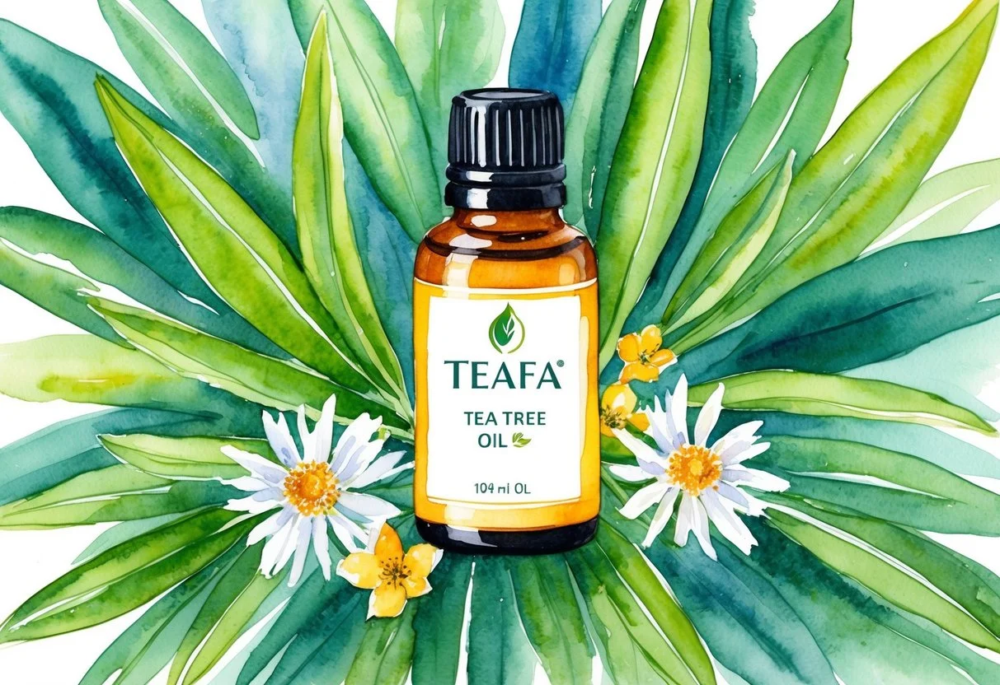

+++
title = "A teafa illóolaj kedvező hatásai és használata: Természetes megoldások a mindennapokra"
description = "Fedezd fel a teafaolaj természetes erejét! Antibakteriális, gombaölő és bőrápoló hatása révén tökéletes választás a mindennapi használatra."
date = 2025-02-17
draft = false
[taxonomies]
tags = ["aromaterápia", "bőrápolás", "stresszoldás", "természetes gyógymód", "gyulladáscsökkentő", "teafa illóolaj", "teafaolaj hatásai", "teafaolaj használata", "antibakteriális", "gombaölő", "pattanások kezelése", "körömgomba ellen", "hajápolás", "fejbőr egészsége", "fertőtlenítő hatás"]
+++

A teafa illóolaja már évszázadok óta népszerűséget élvez kedvező tulajdonságai miatt. Az Ausztráliában őshonos teafa leveleiből származik, és régóta ismert antibakteriális, vírus- és gombaölő hatásáról.

**A teafaolaj hatásosan alkalmazható számos bőrprobléma kezelésére, mint például a pattanásokra és körömgombára.**

Kozmetikai célokra is széleskörűen használják, mivel segít a bőr egészségének megőrzésében és a hajápolásban. Az illóolajjal készült arcápolók és samponok népszerűek azok körében, akik természetes alapú termékeket keresnek.

Az otthoni [aromaterápia](https://jardinessentiel.fr/hu/tags/aromaterapia/) során is előnyös lehet, hiszen frissítő illata hozzájárul a relaxációhoz.

### A legfontosabb tanulságok

* A teafaolaj antibakteriális és gombaölő tulajdonságú.
* Gyakran alkalmazzák bőrproblémák és hajápolás esetén.
* Aromaterápia során frissítő, relaxáló hatása van.

## Teafaolaj eredete és fő tulajdonságai

A teafa illóolaj az ausztráliai Melaleuca alternifolia leveleiből származik. Ez az olaj különösen ismert az antimikrobális és antibakteriális hatékonyságáról.

Az alábbiakban részletesen bemutatásra kerül, hogyan járulnak hozzá a növényi tulajdonságok és az aktív vegyületek az olaj hatékonyságához.

### A Melaleuca alternifolia növény

A Melaleuca alternifolia, vagy más néven teafa, származási helye Ausztrália. A növény a mirtuszfélék családjába tartozik.

A teafa leveleiből készült illóolajat először az őslakos aboriginek használták. Ők már korán felfedezték a növény [antibakteriális tulajdonságai](https://jardinessentiel.fr/hu/tags/termeszetes-gyogymod/)t, melyek a levelek összezúzásával és sebekre helyezésével váltak nyilvánvalóvá.

A teafa növény apró, tűszerű levelekkel rendelkezik. Az olaj kinyerésének folyamata a levelek gőzdesztillálásával történik.

A Melaleuca alternifolia környezetre való érzékenysége miatt óvatosan termesztik, hogy megőrizzék a növény természetes előnyeit.

### Fő vegyületek és hatóanyagok

A teafa illóolaj legismertebb hatóanyaga a terpinen-4-ol, amely erős antibakteriális és antimikrobális tulajdonságokkal rendelkezik.

Az olaj másik fontos összetevője az 1,8-cineol. Habár az 1,8-cineol is jelen van a teafaolajban, alacsonyabb koncentrációban található meg, mivel magasabb szinten irritációt okozhat.

A terpinen-4-ol különösen hatásos a baktériumok és gombák ellen. Ez a vegyület dominál az olajban, amelynek köszönhetően széles körben alkalmazható.

A teafa olajának antibakteriális tulajdonságait különféle kutatások is alátámasztják, amelyek igazolják a fertőzések elleni küzdelemben betöltött szerepét.

## Teafaolaj gyógyászati felhasználása

A teafaolaj számos gyógyászati területen hasznos lehet. Gyakran alkalmazzák bőrproblémákra, légúti betegségeknél és szájüregi problémák kezelésére.

Mindhárom felhasználási mód sok ember számára nyújthat előnyöket, kíméletes alternatívaként a hagyományos gyógyszerekkel szemben.

### Felhasználás bőrproblémákra

A teafaolaj hatékony lehet különféle bőrproblémák kezelésében. Antibakteriális és gombaölő tulajdonságai miatt gyakran használják pattanások és herpesz kezelésére.

Közvetlenül a pattanásokra alkalmazva segítheti a gyógyulást és csökkentheti a gyulladást. Bőrnyugtató hatása miatt irritációkat és kisebb bőrpírokat is enyhíthet.

Emellett a gombás fertőzésekkel szemben is hasznos, így gyakran alkalmazzák lábgomba vagy körömgomba esetén.

Az érzékeny bőrűeknek először ajánlott kis területen tesztelni, hogy elkerüljék az irritációt. A teafaolaj kedvelt összetevő a natúrkozmetikumokban is, mert képes csökkenteni a bőrpírt és a duzzanatot.

### Segítség légúti betegségeknél

Légúti problémák kezelésében is hatásos lehet a teafaolaj. Párologtatóban vagy inhalálva enyhítheti a torokfájást és csökkentheti a légúti fertőzés tüneteit.

Az illóolaj belélegzése segíthet megnyitni a légutakat és könnyíti a légzést, különösen megfázás vagy orrdugulás esetén.

Az otthoni inhalálás során néhány csepp olajat forró vízbe téve, majd felette törölközővel betakarva alkalmazható.

Azonban érzékeny légutak esetén érdemes először kis mennyiségben próbálkozni, hogy a túlzott irritáció elkerülése érdekében.

### Megoldás szájüregi problémákra és higiéniai alkalmazások

A teafaolaj segíthet a szájüregi problémáknál, mint például a fogínygyulladás.

Antibakteriális hatása miatt képes csökkenteni a baktériumok számát a szájüregben, így elősegíti az egészséges ínyek fenntartását.

Házi készítésű szájvíz vagy fogkrém összetevőjeként is használják.

Hígítani kell vízzel vagy más hordozóanyaggal, mielőtt szájöblítőként alkalmazzák.

A rendszeres öblítés segít csökkenteni a rossz leheletet és elősegíti a szájhigiéniát. Az ínyproblémák enyhülése elősegítheti a száj egészséges állapotának megőrzését.

## Kozmetikai felhasználás

A teafaolaj számos tulajdonsága kiaknázható a kozmetikai iparban. Egyszerre javítja a bőr egészségét és kezeli a hajproblémákat, mint például a korpás fejbőrt.

Az alábbiakban részletesebben ismerhetjük meg a teafaolaj kozmetikai alkalmazásait.

### Teafaolaj termékek a bőrápolásban

A teafaolajnak kedvező hatásai vannak a bőrápolásban, különösen az aknés és pattanásos bőr kezelésében.

Antibakteriális és [gyulladáscsökkentő](https://jardinessentiel.fr/hu/tags/gyulladascsokkento/) tulajdonságai miatt számos kozmetikum, mint például arclemosók és krémek alapanyaga.

Ezek a termékek segítenek megtisztítani a bőrfelszínt a felesleges olajtól és szennyeződésektől.

A bőrgyógyászatban is hasznosnak bizonyul, hiszen a teafaolaj képes enyhíteni a bőrirritációt és csökkenteni a bőrpírt.

A hidratáló krémekben való alkalmazásával a száraz és érzékeny bőr is megkönnyebbülést találhat. Emellett a teafaolajat tartalmazó tonikok segítenek visszaállítani a bőr természetes pH-értékét.

### Teafaolaj alapú hajápolás

A teafaolajat széles körben használják hajápolási termékekben, különösen samponokban. Ezek a samponok megszüntetik a fejbőr viszketését és hatékonyan kezelik a korpa okozta kellemetlenségeket.

Vizsgálatok szerint a teafaolaj hatékonyan tisztítja meg a fejbőr pórusait. Ez elősegíti a haj növekedését és egészségének fenntartását. A hajkondicionálók és kezelő spray-k használata pedig biztosítja a haj számára a megfelelő hidratáltságot és fényt. A rendszeres használat segíthet megőrizni a haj erősségét és szépségét.

## Aromaterápia és egyéb háztartási alkalmazások

A teafa illóolaj sokféleképpen felhasználható a mindennapokban. Nemcsak a stressz enyhítésére hasznos az aromaterápiában, de házi készítésű tisztítószerek és rovarriasztók is készíthetők belőle.

Itt találhat [etikusan előállított teafa illóolaj termékeket](https://doterra.me/gcv8rF).

### Teafaolaj a mindennapi életben

Aromaterápiában a teafa illóolaj segíthet csökkenteni a stresszt. Belélegezve különösen hatékony lehet feszültségoldásra. A **teafaolaj** erős fertőtlenítő hatásának köszönhetően a levegőtisztításra is megfelelő, ami különösen hasznos penészes helyeken.

A mindennapi élet során az emberek gyakran használják a bőrápolásban, például kisebb bőrhibák kezelésére. Fontos megjegyezni, hogy az **illóolajokat** mindig hígított formában kell alkalmazni.

### Házi készítésű tisztítószerek és rovarriasztók

A teafaolaj kiváló hozzávaló lehet házilag készített tisztítószerekben. Antibakteriális tulajdonságai miatt segít hatékonyan eltávolítani a szennyeződéseket.

A meleg vízbe kevert pár csepp **teafaolaj** remek fertőtlenítő oldatot képez.

Rovarriasztóként is alkalmazható, távol tartja a kellemetlen kártevőket otthonából. Illata természetes módon távolítja el a rovarokat, és környezetbarát alternatívát nyújt a vegyszeres megoldásokkal szemben.
