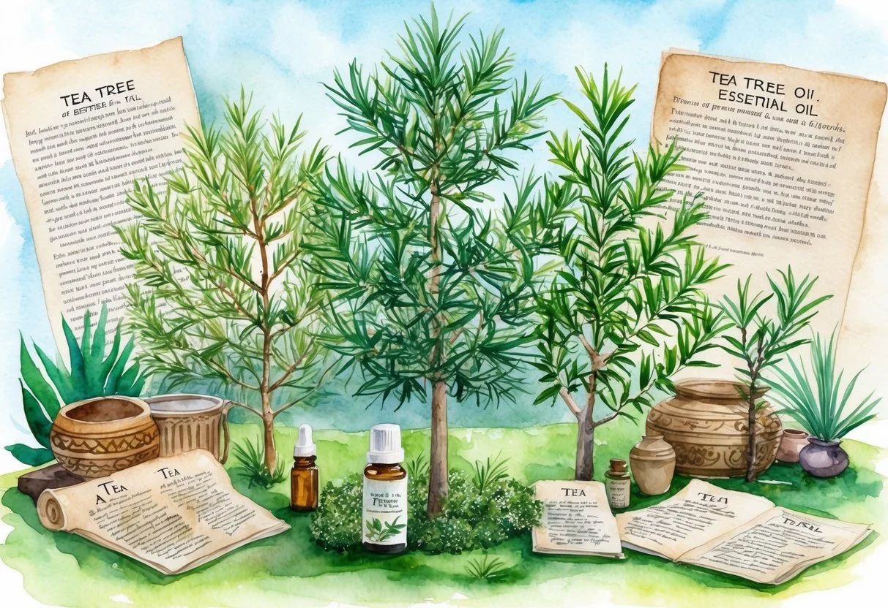
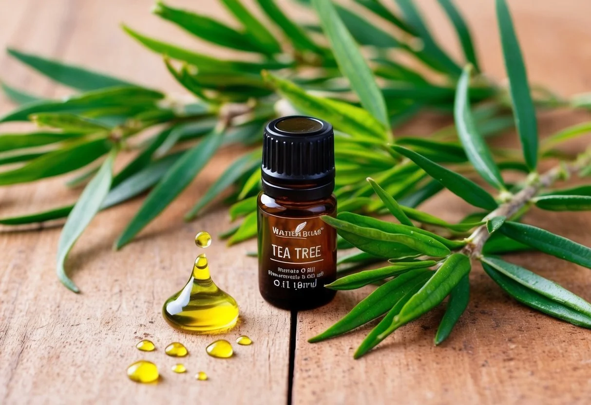

+++
title = "Benefits and Usage of Tea Tree Essential Oil: A Comprehensive Guide"
description = "Tea tree essential oil offers powerful antibacterial, antifungal, and anti-inflammatory benefits for skin, hair, and home use. Learn its uses and safety tips!"
date = 2025-02-17
draft = false
[taxonomies]
tags = ["Natural remedies", "Essential oils for skin", "Organic skincare", "Holistic healing", "Tea tree essential oil", "Benefits of tea tree oil", "Tea tree oil for acne", "Aromatherapy with tea tree", "Tea tree oil for hair growth", "Uses of tea tree essential oil"]
+++

Tea tree essential oil, derived from the leaves of *Melaleuca alternifolia*, offers various benefits for health and wellness.

Known for its strong antiseptic properties, tea tree oil can effectively address skin concerns, support hair health, and even serve as a natural cleaner for home use.

**Tea tree oil is praised for its antibacterial abilities and is used widely across the world for its potential health applications**.

This essential oil has a rich history in traditional medicine, primarily among the native communities in Australia.

Over the years, studies have highlighted tea tree oil's effectiveness in promoting skin and hair health.

From clearing up acne to invigorating the scalp, this oil is both versatile and potent.

To ensure safe usage, it is important to understand the right application methods and any precautions related to this essential oil.

Being aware of its environmental impact and choosing sustainably sourced products can further enhance its benefits.

### Key Takeaways

* Tea tree oil is known for its antiseptic and antibacterial properties.
* Derived from *Melaleuca alternifolia*, it offers skin and hair care benefits.
* Safe and sustainable usage enhances its environmental impact.

## Historical and Botanical Background

Tea tree oil, known for its antimicrobial and anti-inflammatory properties, has a rich history rooted in traditional uses by indigenous communities.

It is derived from Melaleuca alternifolia, an Australian native plant. This oil is extracted through steam distillation, with key components such as terpinen-4-ol and alpha-terpineol playing vital roles in its therapeutic effects.

### Origin of Tea Tree

Tea tree oil comes from the tea tree, scientifically known as Melaleuca alternifolia. This tree is primarily found in New South Wales, Australia.

Indigenous Australians were the first to discover its healing properties. They used tea tree leaves to make herbal remedies, inhaling the vapors from crushed leaves to treat coughs and colds, and applying poultices to wounds and skin conditions.

This traditional knowledge laid the groundwork for modern uses of tea tree oil.

As word of its effectiveness spread, it garnered global attention and eventually became a staple in skincare and therapeutic remedies worldwide.

### Extraction and Composition

Tea tree oil is obtained through a process known as steam distillation. This method involves steaming the leaves of the Melaleuca alternifolia to extract the essential oil.

The oil's effectiveness is credited to its composition, which includes compounds like **terpinen-4-ol** and **alpha-terpineol**.

Terpinen-4-ol is particularly noted for its potent antimicrobial properties, making the oil effective against various pathogens.

Alpha-terpineol adds to these benefits with its anti-inflammatory and soothing effects, contributing to the oil's overall effectiveness in treating skin conditions such as acne and dandruff.

These components make tea tree oil a valued product in natural and alternative medicine.

## Therapeutic Properties

Tea tree essential oil is known for its vast therapeutic properties. It offers benefits such as antimicrobial, antibacterial, antifungal, antiviral, anti-inflammatory, and wound healing effects.

### Antimicrobial and Antibacterial Effects

Tea tree oil is well regarded for its strong **antibacterial properties**. It can combat a variety of bacteria, making it effective for antiseptic applications.

This essential oil is often used in topical treatments to prevent or reduce bacterial infections.

In particular, research has shown that tea tree oil can help with skin conditions like acne by targeting bacteria that contribute to breakouts.

Products containing this oil are popular in [skincare routines](https://jardinessentiel.fr/tags/organic-skincare/) for those who suffer from frequent skin issues.

The oil's components, such as terpinen-4-ol, play a crucial role in these effects.

By breaking down the bacterial cell walls, tea tree oil ensures a more effective and rapid cleansing process.

For anyone looking for a natural antimicrobial solution, tea tree oil's capabilities make it a valuable choice.

### Antifungal and Antiviral Actions

Tea tree oil's **antifungal and antiviral properties** are noteworthy. It actively fights against various types of fungi and viruses.

This makes it a reliable option for treating fungal infections like athlete's foot and nail fungus.

Individuals seeking relief from frequent fungal irritations may find tea tree oil particularly useful.

Its antiviral action is also beneficial, though it is mainly highlighted for its prowess against fungi.

**Antiseptic properties** help keep affected areas clean and limit the spread of viruses.

Using tea tree oil diluted with carrier oils, such as coconut or olive oil, can enhance these properties.

Regular use can provide a natural barrier against recurring infections.

### Anti-inflammatory and Healing Benefits

Tea tree oil offers significant **anti-inflammatory benefits**, which aid in reducing swelling and redness in affected areas.

This makes it a popular choice for treating inflammation-related conditions.

Its [natural compounds](https://jardinessentiel.fr/tags/holistic-healing/) work to soothe and heal irritated skin.

Additionally, tea tree oil promotes faster **wound healing** due to its antiseptic nature.

By protecting the skin from infection, it accelerates the body's natural healing process.

Applying diluted tea tree oil can reduce inflammation and support recovery.

## Skin and Hair Care Applications

Tea tree oil can be a beneficial addition to skincare and hair routines. It is known for its antiseptic and anti-inflammatory properties, which can aid in managing various skin issues and promoting hair health.

### Acne and Skin Blemishes

Tea tree oil is popular for treating acne. Its natural antibacterial properties help fight the bacteria that cause pimples.

Those with mild to moderate acne have reported improvements when using tea tree oil-infused products.

For best results, it should be applied sparingly to blemishes using a diluted solution to reduce the risk of skin irritation.

The oil can also help reduce redness and swelling associated with acne.

Some find it to be a gentler alternative to harsher acne treatments like benzoyl peroxide.

When used consistently, tea tree oil may help achieve clearer-looking skin.

### Managing Skin Conditions

Tea tree oil is used for various skin conditions, including eczema and psoriasis. Its soothing qualities can provide relief from itching and inflammation.

Many people use diluted tea tree oil applications to calm irritated skin and potentially reduce flare-ups.

Eczema sufferers may find it beneficial for keeping the skin clean and preventing infection.

Psoriasis plaques can also become less prominent with regular use.

Mixing the oil with a carrier oil like coconut or olive oil is recommended to avoid potential skin irritation while enjoying its benefits.

### Hair Treatment and Scalp Health

Tea tree oil supports scalp health by moisturizing the scalp and preventing dryness.

Regular use can lead to [stronger hair](https://cityskinclinic.com/benefits-tea-tree-oil-skin-hair/) and less breakage.

It's also effective against dandruff and can alleviate an itchy scalp.

When mixed with shampoo, it aids in gently cleansing the scalp of impurities.

Its natural insecticidal properties make it an option for treating head lice.

It helps to both combat lice and support overall scalp health.

Incorporating tea tree oil into hair care routines can contribute to healthy, shiny hair.

## Medical Uses and Studies

Tea tree oil is recognized for its potential in treating various health conditions. It is valued for its antimicrobial properties and has been studied for its effects on skin infections and respiratory health.

### Supporting Research

Tea tree oil has been the subject of numerous studies due to its broad-spectrum antimicrobial effects.

Research shows that even low concentrations, such as 0.04%, can effectively combat fungi responsible for conditions like athlete's foot.

The [National Center for Biotechnology Information](https://pmc.ncbi.nlm.nih.gov/articles/PMC10080088/) highlights its long history of use in traditional medicine, particularly by First Nations Australians for wounds and insect bites.

Scientific reviews underline its efficacy and call for further investigation to understand the full scope of its medicinal properties better.

### Clinical Applications

In clinical settings, tea tree oil is often used to address skin infections and onychomycosis, a fungal infection affecting nails.

Its role in respiratory health has also been explored, although more evidence is needed.

Tea tree oil is included in products aimed at reducing symptoms of acne, dandruff, and even mild athlete's foot.

Despite its popularity, experts caution about potential skin irritation and recommend it be used in diluted form.

The [Natural Remedy Ideas](https://naturalremedyideas.com/tea-tree-oil/) emphasize its medicinal potential but also note the need for more comprehensive trials to establish safety and efficacy across a broader range of uses.

## Home and Personal Care

Tea tree essential oil is versatile and can be used in daily routines to clean surfaces and maintain personal hygiene. Its natural antibacterial properties make it a popular choice for making homemade products.

### Natural Cleaning Agent

Tea tree oil is effective as an *all-purpose cleaner*. A few drops can be added to water and vinegar to make a spray that helps sanitize surfaces and repel insects.

Its antimicrobial qualities make it suitable for cleaning areas like kitchens and bathrooms where germs are common.

For those seeking eco-friendly solutions, tea tree oil can be blended into homemade cleaning wipes.

This helps reduce the use of harsh chemicals in the home. The refreshing scent also leaves a pleasant aroma.

### Personal Hygiene Products

In personal care, tea tree oil works well as a *natural deodorant*.

Its ability to kill odor-causing bacteria makes it a potent alternative to conventional deodorants. For a simple recipe, mix a few drops with coconut oil and baking soda.

Tea tree oil can be a beneficial ingredient in *hand sanitizers*.

It offers a natural way to keep hands germ-free without the drying effects of alcohol-based products.

Additionally, it's useful in making *homemade mouthwash* that promotes **oral health**.

A diluted solution helps reduce bacteria responsible for bad breath and supports overall mouth hygiene.

### Conducting a Patch Test

Before using tea tree oil, especially for topical use, conducting a patch test is essential. This helps identify potential allergic reactions or contact dermatitis.

To perform a patch test, dilute a small amount of tea tree oil with a carrier oil like coconut or jojoba oil.

Apply the mixture to a small area on the forearm and cover it with a bandage. Wait 24-48 hours to observe any reactions.

If there is no redness, itching, or swelling, the oil is likely safe for broader application. However, if any irritation occurs, discontinue use immediately.

### Proper Dilution and Usage

Tea tree oil should never be used undiluted on the skin, as this can lead to skin irritation or even an allergic reaction.

Proper dilution involves mixing tea tree oil with a carrier oil to reduce its concentration. A common ratio is one drop of tea tree oil to 12 drops of carrier oil.

In addition, special care should be taken when using the oil on children, pregnant women, or individuals with sensitive skin. It is also advisable to consult a healthcare professional before use.

## Environmental Impact and Sustainability

Tea tree oil, derived from *Melaleuca alternifolia*, has gained popularity, but its production affects environmental sustainability. Understanding sustainable practices and ecological impacts can help reduce harm to natural resources.

### Sustainable Farming

Sustainable farming of tea tree oil involves practices that protect the environment and conserve resources.

Crop rotation is key, helping maintain soil health by varying the plants grown in succession.

Implementing organic farming techniques minimizes chemical use, reducing pollution and promoting biodiversity.

Using renewable resources like rainwater for irrigation also conserves water.

Furthermore, selecting ethical suppliers that prioritize sustainability ensures environmentally-friendly production.

Here you can find [ethically produced tea tree essential oil products](https://doterra.me/t7Cm3d).

### Ecological Considerations

The ecological impact of tea tree oil production is an essential factor.

Processing essential oils requires energy-intensive distillation, contributing to carbon emissions.

The production should include energy-efficient methods to reduce this environmental footprint.

Disposing of tea tree oil properly is crucial as it is highly flammable, necessitating responsible waste management techniques.

Opting for recyclable or biodegradable packaging can further reduce waste.

Consumers can support eco-friendly practices by purchasing from brands committed to sustainability, ethical sourcing, and transparency in their environmental practices.
